# Project Rome

----------
## Overview
Con el paso del tiempo el uso de los dispositivos por parte de los usuarios ha cambiado radicalmente.  
Actualmente los usuarios utilizan más de un dispositivo durante el día y lo más normal es que el día comience en un tipo de dispositivo continúe en otros y finalmente acabe con otro definitivo:  
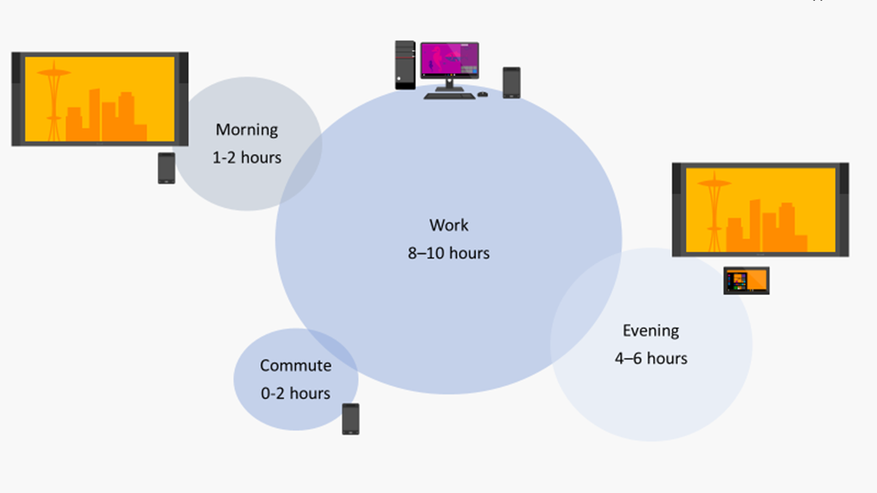  
En la imagen anterior se puede ver el tiempo aproximado y horas en las que los usuarios utilizan los dispositivos.  
Lo que podemos deducir de esto es que actualmente los sistemas y las aplicaciones nos deben permitir continuar nuestro trabajo en el punto en que lo dejamos en los diferentes dispositivos sin necesidad de la interacción del usuario.  
**Project Rome** nos ofrece una serie de funciones de colaboración entre dispositivos y plataformas que permiten a los desarrolladores a centrarse en los usuarios y sus tareas en lugar de los dispositivos.  
  

## Project Rome  

**Project Rome** se centra en cuatro aspectos como se muestra en la siguiente imagen:   
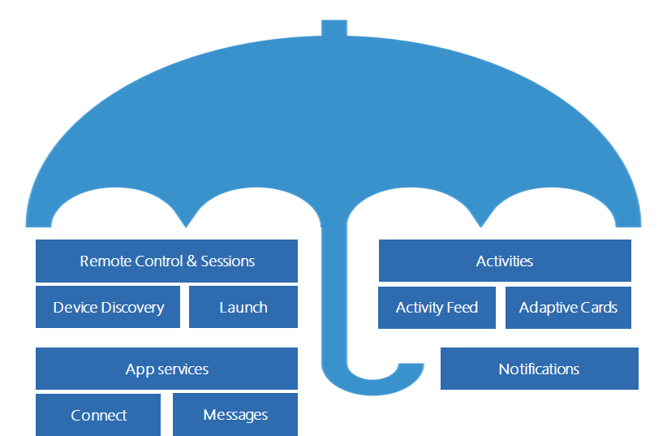    

- **Remote Control & Sessions:** Microsoft Graph vincula aquellos dispositivos que hemos usados a nuestro usuario, lo que nos permitirá a través de su API encontrar cuales son nuestros dispositivos y lanzar aplicaciones de un dispositivo a otro, independientemente del sistema operativo del dispositivo.  
- **Activities:** Esta opción nos permite guardar en Microsoft Graph actividades que nos permite guardar que aplicaciones estamos usando y la información necesaria para que esta sea lanzada desde otro dispositivo, además nos permite utilizar Adaptive Cards para mostrar un icono único con información visual de nuestra aplicación.  
- **Notificaciones:** Una de las últimas características que se han introducido es la capacidad de poder enviar notificaciones push a nuestras aplicaciones a través de Graph de forma que lleguen a todos nuestros dispositivos que tengan esta aplicación. También nos permite gestionar estas notificaciones entre los diferentes dispositivos de forma que podemos borrarlas de todos ellos una vez leídas o actualizarlas, y todo ello a través Graph.  
- **App Services:** Por último, nos permite conectar dos aplicaciones en “real-time” de forma que una de ellas haga de servidor, la otra se conecte a ella y le pueda pedir información que el servidor les responderá.  

## Objetivos

En este Hands on lab vamos a aprender como utilizar **Microsoft Timeline** y **Adaptvie cards**.  
Para ello construiremos paso a paso una aplicación **UWP** a la cuál generaremos una Adaptive Card, guardaremos la sesión en Timeline y finalmente utilizaremos Pick up where you left para continuar donde estábamos.  

## Pre requisitos  

A continuación se detallan los requisitos previos y los pasos necesarios para configurar el equipo. Después de completar esta sección tendrás todo lo necesario para completar este hands on lab.

- Instalar o actualizar [Visual Studio Community 2017](https://visualstudio.microsoft.com/vs/) o [Visual Studio Enterprise 2017](https://visualstudio.microsoft.com/es/vs/), version 15.7+  

- Verificar que está activado  Windows 10 [development mode](https://docs.microsoft.com/es-es/windows/uwp/get-started/enable-your-device-for-development#accessing-settings-for-developers).

-  Asegurarse que tienes instaladas las the tools for[ Windows 10 development(Build 17134 or higher)](https://developer.microsoft.com/en-us/windows/downloads)

- Tener Windows 10 actualizado al menos la versión April 2018 update.  

## Microsoft Timeline

**Microsoft Graph** tiene una nueva característica: **UserActivity**.  
Las **UserActivites** generadas por las aplicaciones aparecen en el Timeline. Al escribir **UserActivities** en **Microsoft Graph**, se puede expresar contenido específico dentro de la aplicación como un destino que se muestra en Windows y es accesible en los dispositivos iOS y Android.  

Cada **UserActivity** representa un solo destino dentro de la aplicación. Cuando se participa en esa actividad (mediante la creación de un juego de datos de actividad), el sistema crea un registro de historial que indica la hora de inicio y de fin de esa actividad. A medida que vuelva a conectarse con esa **UserActivity** a lo largo del tiempo, se registrarán varios Registros Históricos para una única **UserActivity**.  

Cuando las actividades aparecen en el **Timeline**, las mostramos usando el marco de trabajo de la Adaptive Card. Se pueden configurar estas tarjetas o, si no proporciona una Adaptive Card, **Timeline** creará automáticamente una [Adaptive Card](https://adaptivecards.io/) simple basada en su actividad. 

## Hand on lab
Como ya hemos comentado el HOL consistirá en crear desde cero una aplicación **UWP** que reproducirá videos de youtube y aprenderemos a:  

1. Crear una **UserActivity** y guardarla en **Microsoft Graph**.  
2. Visualización en **Timeline**.  
3. Creación de una **Adaptive Card**.  
4. Pick up where you left.  

### Creando nuestra UWP  

----------

- File - New - Project. Poner el nombre de Office365DevBootcampMadrid para no tener problemas de namespaces
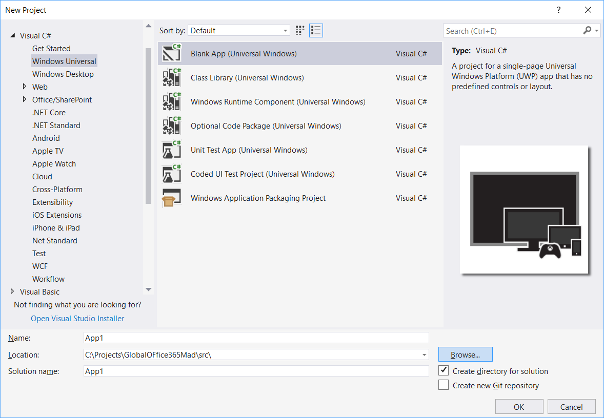 

- Añadimos el paquete nuget MyToolkit.Extended que contien controles para interactuar con youtube  
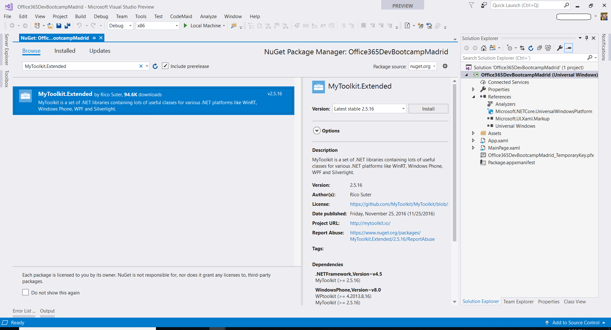

- Añadimos una capeta Models, creamos una clase llamada YouTubeVideo.cs y añadimos el siguiente código:  

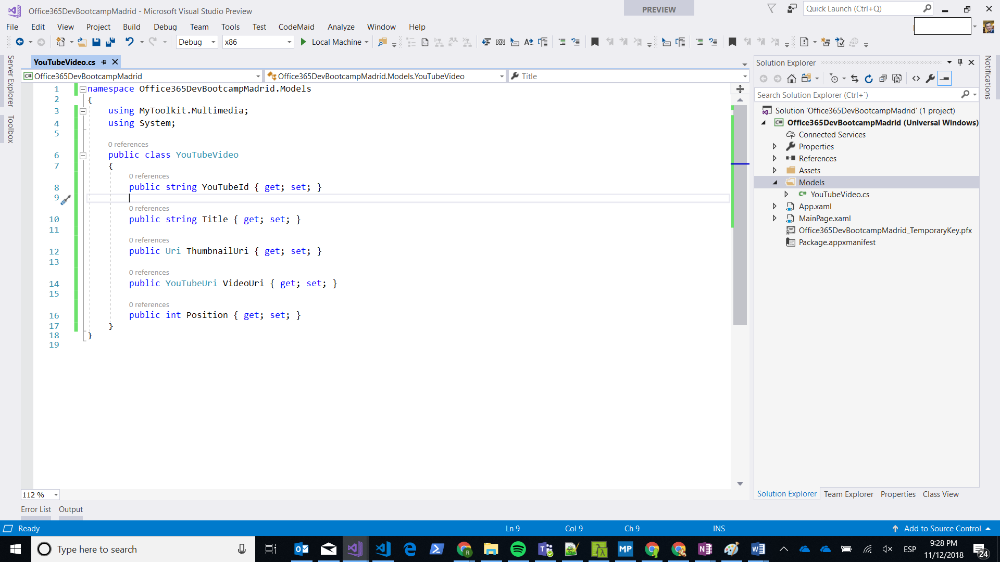  

		namespace Office365DevBootcampMadrid.Models
		{
    		using MyToolkit.Multimedia;
    		using System;

    		public class YouTubeVideo
		    {
		        public string YouTubeId { get; set; }
		
		        public string Title { get; set; }
		
		        public Uri ThumbnailUri { get; set; }
		
		        public YouTubeUri VideoUri { get; set; }
		
		        public int Position { get; set; }
		    }
		}

- En MainPage.xaml añadir el siguiente código:  

		<Page
	    x:Class="Office365DevBootcampMadrid.MainPage"
	    xmlns="http://schemas.microsoft.com/winfx/2006/xaml/presentation"
	    xmlns:x="http://schemas.microsoft.com/winfx/2006/xaml"
	    xmlns:local="using:Office365DevBootcampMadrid"
	    xmlns:d="http://schemas.microsoft.com/expression/blend/2008"
	    xmlns:mc="http://schemas.openxmlformats.org/markup-compatibility/2006"
	    mc:Ignorable="d"
	    Background="{ThemeResource ApplicationPageBackgroundThemeBrush}">
	    <Grid>

        <Grid.RowDefinitions>
            <RowDefinition Height="Auto" />
            <RowDefinition Height="*" />
        </Grid.RowDefinitions>

        <TextBlock Style="{StaticResource HeaderTextBlockStyle}"
                   Text="YouTube videos"
                   Margin="20 20 0 0" />
        <Grid Margin="20"
              Grid.Row="1">
            <Grid.ColumnDefinitions>
                <ColumnDefinition Width="3*" />
                <ColumnDefinition Width="*" />
            </Grid.ColumnDefinitions>

            <Grid VerticalAlignment="Top"
                  Margin="0 20 20 20">
                <Grid.RowDefinitions>
                    <RowDefinition Height="*" />
                    <RowDefinition Height="Auto" />
                    <RowDefinition Height="Auto" />
                </Grid.RowDefinitions>

                <MediaElement x:Name="Player" />
                <TextBlock x:Name="TxtVideoName"
                           Grid.Row="1"
                           Style="{StaticResource SubtitleTextBlockStyle}" />

                <!--COMMANDS BAR-->
                <StackPanel Orientation="Horizontal"
                            Grid.Row="2"
                            HorizontalAlignment="Center">
                    <AppBarButton Label="Previous"
                                  Icon="Previous" x:Name="Previous"/>
                    <AppBarButton Label="Play"
                                  Icon="Play" x:Name="Play" Click="btn_Click_PlayVideo"/>
                    <AppBarButton Label="Pause"
                                  Icon="Pause" x:Name="Pause" Click="btn_Click_PauseVideo" IsEnabled="False"/>
                    <AppBarButton Label="Next"
                                  Icon="Next" x:Name="Next"/>
                </StackPanel>
            </Grid>

            <!--VIDEOS LISTE-->
            <ListView x:Name="LVVideos"
                      Grid.Column="1"
                      VerticalAlignment="Top"
                      ItemClick="LVVideos_ItemClick"
                      SelectionMode="None"
                      IsItemClickEnabled="True">
                <ListView.ItemTemplate>
                    <DataTemplate>
                        <StackPanel>
                            <Image Source="{Binding ThumbnailUri}"
                                   Height="250"
                                   Width="250" />
                            <TextBlock HorizontalAlignment="Center"
                                       VerticalAlignment="Top"
                                       Text="{Binding Title}"
                                       FontSize="11"
                                       TextWrapping="WrapWholeWords" />
                        </StackPanel>
                    </DataTemplate>
                </ListView.ItemTemplate>
            </ListView>
        </Grid>
    </Grid>
	</Page>  
 
- Ahora en MainPaaig.xaml.cs:  
	- Añadimos las siguientes variables a la clase:  
	
		    private ObservableCollection<YouTubeVideo> YouTubeVideosCollection;  
    		private bool isPlayVideo;  
    		private List<YouTubeVideo> LstVideos;  
  
	- Añadimos un método que iniciliazará la lista de los videos a mostrar:  

				private async Task<List<YouTubeVideo>> GetYouTubeVideos()
		        {
		
		            LstVideos = new List<YouTubeVideo>()
		           {
		                new YouTubeVideo
		               {
		                   YouTubeId="GtrTFEBJsrY",
		                   Title=await YouTube.GetVideoTitleAsync("GtrTFEBJsrY"),
		                   ThumbnailUri= YouTube.GetThumbnailUri("GtrTFEBJsrY",YouTubeThumbnailSize.Medium),
		                   VideoUri=await YouTube.GetVideoUriAsync("GtrTFEBJsrY",YouTubeQuality.Quality360P)
		               },
		               new YouTubeVideo
		               {
		                   YouTubeId="835SuKlvO_8",
		                   Title=await YouTube.GetVideoTitleAsync("835SuKlvO_8"),
		                   ThumbnailUri= YouTube.GetThumbnailUri("835SuKlvO_8",YouTubeThumbnailSize.Medium),
		                   VideoUri=await YouTube.GetVideoUriAsync("835SuKlvO_8",YouTubeQuality.Quality360P)
		               }	
		           };
		
		            return LstVideos;
		        }  
  
	- Ahora añadiremos el método para controlar los controles de play y pause:  

 		
		    private void PlayVideo()  
		    {
			    if (isPlayVideo)
			    {
				    Player.Pause();
				    isPlayVideo = false;
				    Play.IsEnabled = true;
				    Pause.IsEnabled = false;
			    }
			    else
			    {
				    Player.Play();
				    isPlayVideo = true;
				    Play.IsEnabled = false;
				    Pause.IsEnabled = true;
			    }
		    }  

	- Implementamos el métod que al seleccionar un video de la lista lo reproduzca:  

			private void LVVideos_ItemClick(object sender, ItemClickEventArgs e)  
			{  
			    YouTubeVideo video = (YouTubeVideo)e.ClickedItem;  
			
			    Player.Source = video.VideoUri.Uri;  
			    TxtVideoName.Text = video.Title;  
			    PlayVideo();  
			}  

	- Por último implementamos los handlers para los botones de play y pause:  

			private void btn_Click_PlayVideo(object sender, Windows.UI.Xaml.RoutedEventArgs e)
			{
			    PlayVideo();
			}
			
			private void btn_Click_PauseVideo(object sender, Windows.UI.Xaml.RoutedEventArgs e)
			{
			    PlayVideo();
			}  

	- Por último sobreescribimos el método OnNavigateTo para cargar los videos y hacer el binding correspondiente:  

			protected override async void OnNavigatedTo(NavigationEventArgs e)
			{
			    base.OnNavigatedTo(e);
			
			    List<YouTubeVideo> YouTubeVideos = await GetYouTubeVideos();
			    YouTubeVideosCollection = new ObservableCollection<YouTubeVideo>(YouTubeVideos);
			    LVVideos.ItemsSource = YouTubeVideos;
			}

	- Ahora ejectumos la aplicación:  

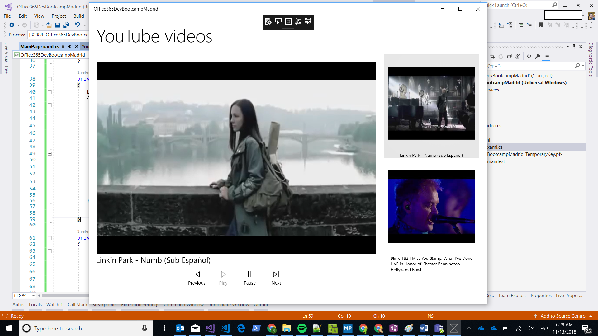  

### Añadiendo timeline  

----------

- Ahora añadiremos el código necesario para que aparezca en **Timeline**. Configuraremos la app para que pueda ser lanzada desde un launcher para ello vamos al Package.appxmanifest - Declarations. Buscamos protocal, lo añadimos y en Name poner officedev.  
	
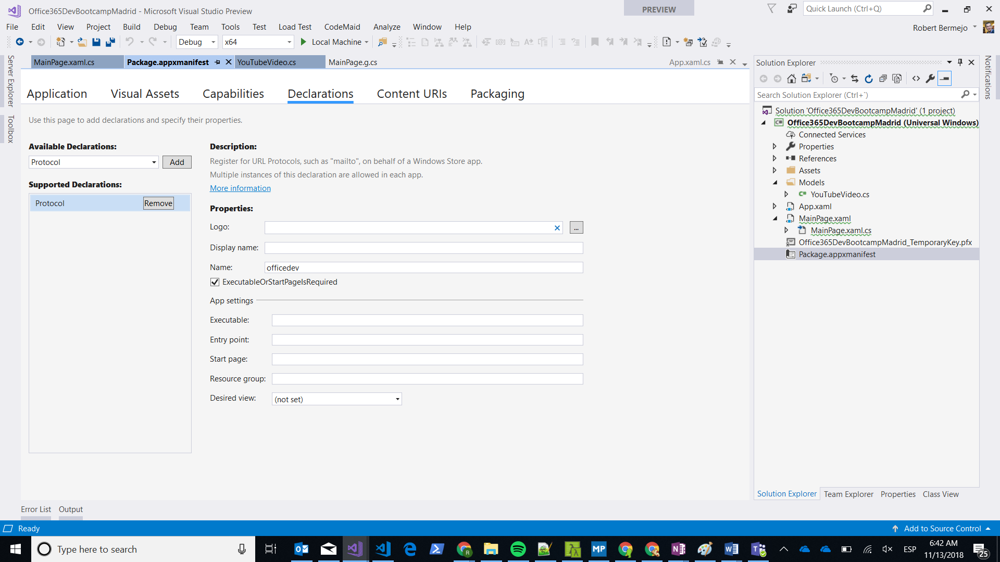  

- Ahora vamos a Timeline y veremos que nos ha creado la entrada de nuestra app. Como no hemos añadido ninguna **Adaptvie Card** todavía nos ha añadido una por defecto.  

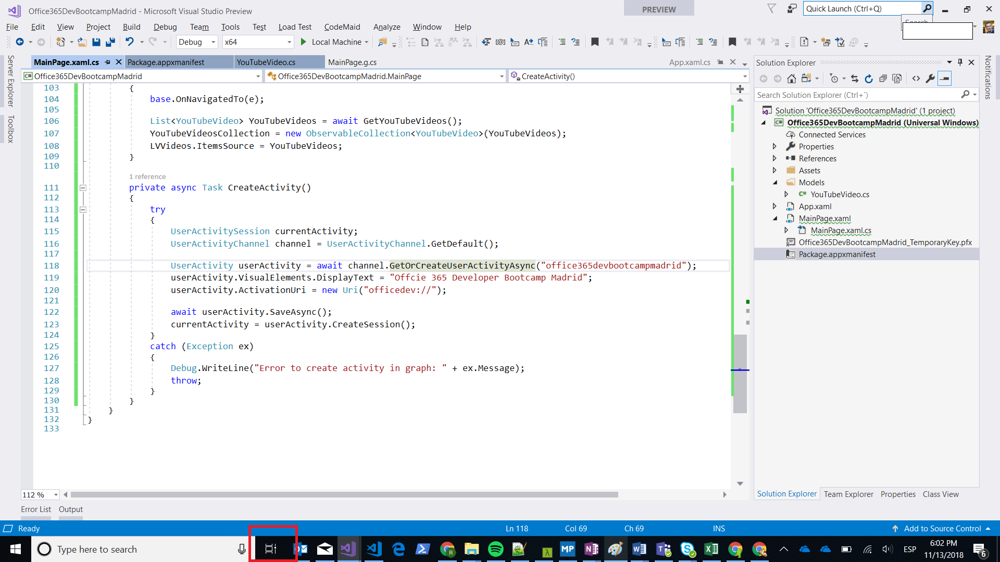  

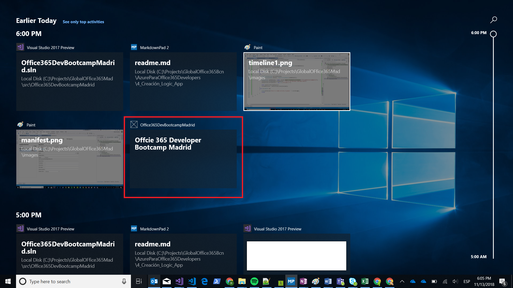  

- Ahora si hacemos click, la app se abre pero se queda solo en el splashcreen.  

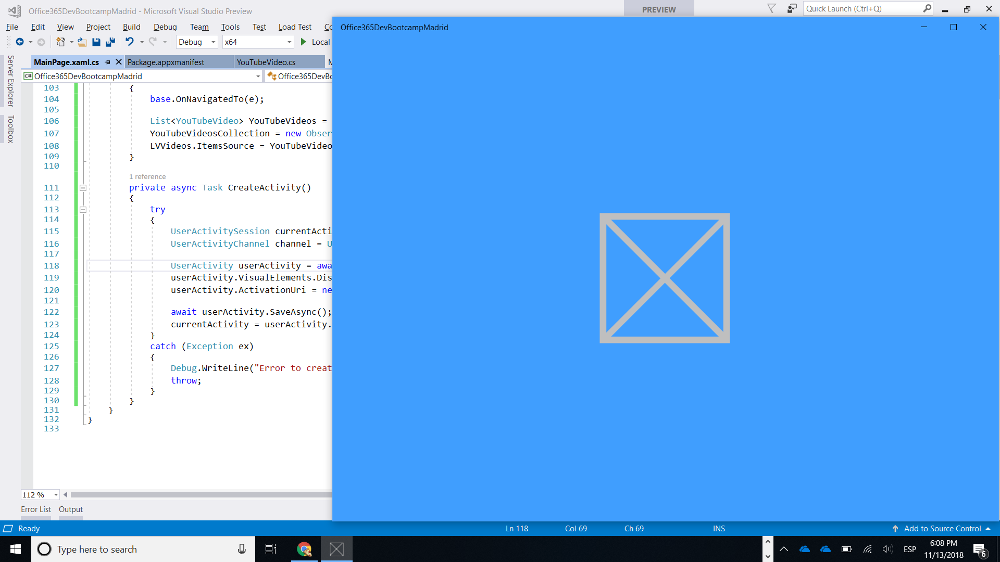  

### Añadiendo Pick up where you left

----------

- Ahora lo que haremos serán dos cosas:  

1. Hacer que cuando abramos la aplicación se abra donde toca.
2. Nos la abra donde lo habíamos dejado, en este caso que emppieze la reproducción del video que estábamos viendo.

-  En App.xaml.cs añadimos el siguiente código:  

		protected override void OnActivated(IActivatedEventArgs e)
		{
		    Frame rootFrame = Window.Current.Content as Frame;
		    var isOpenApp = rootFrame != null;
		
		    if (e.Kind == ActivationKind.Protocol)
		    {
		        var uriArgs = e as ProtocolActivatedEventArgs;
		        if (uriArgs != null)
		        {
		            rootFrame = new Frame();
		            Window.Current.Content = rootFrame;
		            rootFrame.Navigate(typeof(MainPage), uriArgs.Uri.Query);
		        }
		    }
		
		    Window.Current.Activate();
		}  
- Ahora ejecutamos la aplicación, paramos Visual studio, vamos a **Timeline** y la arrancamos, vermeos que nuestra app se abre.

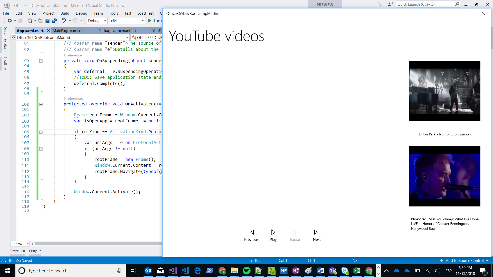  

- Como podemos ver en el código anterior,vemos que ya lo hemos preparado para recibir parámetros, lo que vamos ha hacer es modificar el código para que cuando guardemos la Activity y volvamos aa abrir la app lo haga donde estábamos.  

- En Main.xaml.cs añadiremos el siguiente código que nos permitirá abrir la app en el video en el que estábamos  

		internal void HandleCommand(string commandString)
		{
		    if (!string.IsNullOrWhiteSpace(commandString))
		    {
		        commandString = commandString.TrimStart('?').ToLower();
		        var video = YouTubeVideosCollection.Where(x => x.YouTubeId.ToLower() == commandString.ToLower()).First();
		        Player.Source = video.VideoUri.Uri;
		        TxtVideoName.Text = video.Title;
		        isPlayVideo = false;    
 				CreateActivity();            
		        PlayVideo();
		    }
		}  

- Ahora en la misma clase en método OnNavigatedTo añadiremos estas dos líneas:  

		var command = (string)e.Parameter;
		this.HandleCommand(command);  

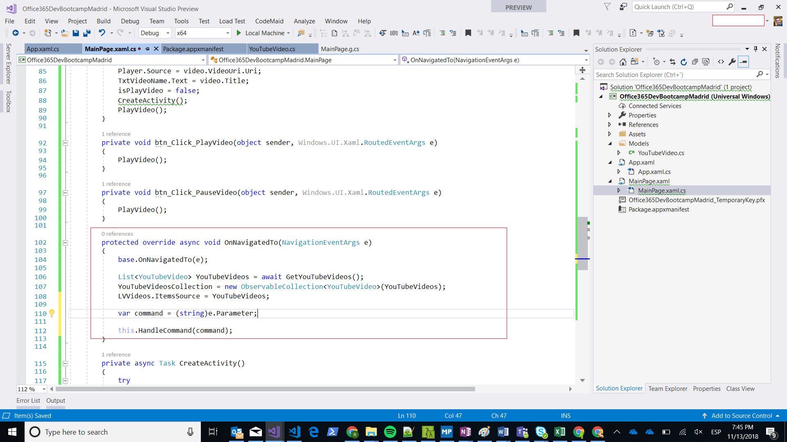  

- Ahora modifacremos el método CreateActivity de esta misma clase. A este método le añadiremos un parámetro que será el identificador del video de youtube. Además modifcaremos los métodos LVVideos_ItemClick y HandleCommand para pasar el id del video al método. El método CreateActivity quedará:  

		private async Task CreateActivity(string youtubeId)
		{
		    try
		    {
		        UserActivitySession currentActivity;
		        UserActivityChannel channel = UserActivityChannel.GetDefault();
		
		        UserActivity userActivity = await channel.GetOrCreateUserActivityAsync("office365devbootcampmadrid");
		        userActivity.VisualElements.DisplayText = "Offcie 365 Developer Bootcamp Madrid";
		        userActivity.ActivationUri = new Uri($"officedev://command?{youtubeId}");
		
		        await userActivity.SaveAsync();
		        currentActivity = userActivity.CreateSession();
		    }
		    catch (Exception ex)
		    {
		        Debug.WriteLine("Error to create activity in graph: " + ex.Message);
		        throw;
		    }
		}  

El método HandleCommand quedará:  

		internal void HandleCommand(string commandString)
		{
		    if (!string.IsNullOrWhiteSpace(commandString))
		    {
		        commandString = commandString.TrimStart('?').ToLower();
		        var video = YouTubeVideosCollection.Where(x => x.YouTubeId.ToLower() == commandString.ToLower()).First();
		        Player.Source = video.VideoUri.Uri;
		        TxtVideoName.Text = video.Title;
		        isPlayVideo = false;
		        CreateActivity(video.YouTubeId);
		        PlayVideo();
		    }
		}

Y él método LVVideos_ItemClick:  

		private void LVVideos_ItemClick(object sender, ItemClickEventArgs e)
		{
		    YouTubeVideo video = (YouTubeVideo)e.ClickedItem;
		
		    Player.Source = video.VideoUri.Uri;
		    TxtVideoName.Text = video.Title;
		    isPlayVideo = false;
		    CreateActivity(video.YouTubeId);
		    PlayVideo();
		}

Ahora seleccionar un video, cerrar la aplicación ir a Timeline y lanzar la app, está se abrirá en el video que estabais viendo.

### Adapotive Card

----------

Ahora vamos a darle formato a nuestra tarjeta en **Timeline**, para ello lo haremos con [Adaptive Cards](https://adaptivecards.io/)(Mirar el link antes de continuar)  
Para ello lo que primero que haremos es crear un fichero llamado AdaptiveCard.json y añadir el siguiente código:  

	{
	  "$schema": "http://adaptivecards.io/schemas/adaptive-card.json",
	  "type": "AdaptiveCard",
	  "version": "1.0",
	  "backgroundImage": "{{backgroundImage}}",
	  "body": [
	    {
	      "type": "Container",
	      "items": [
	        {
	          "type": "TextBlock",
	          "text": "Timeline",
	          "weight": "bolder",
	          "size": "extraLarge",
	          "wrap": true,
	          "maxLines": 3
	        },
	        {
	          "type": "TextBlock",
	          "text": "{{name}}",
	          "size": "medium",
	          "wrap": true,
	          "maxLines": 3
	        }
	      ]
	    }
	  ]
	}  

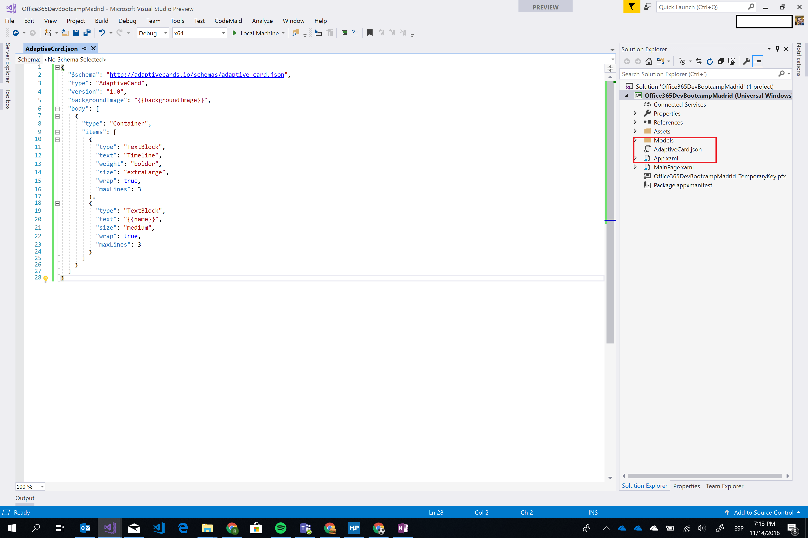  

Una vez añadido seleccionar propiedades del fichero y en Build Action poner content.  
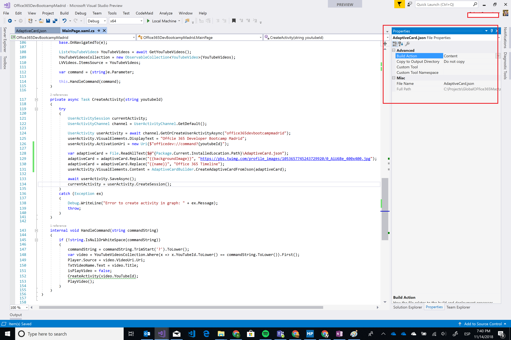  

Por último en Main.xaml.cs en el método CreateActivity añadimos las siguientes líneas:  

	var adaptiveCard = File.ReadAllText($@"{Package.Current.InstalledLocation.Path}\AdaptiveCard.json");
	adaptiveCard = adaptiveCard.Replace("{{backgroundImage}}", "https://secure.meetupstatic.com/photos/event/1/3/c/2/600_474005058.jpeg");
	adaptiveCard = adaptiveCard.Replace("{{name}}", "Office 365 Timeline");
	userActivity.VisualElements.Content = AdaptiveCardBuilder.CreateAdaptiveCardFromJson(adaptiveCard);

El código quedaría así:  
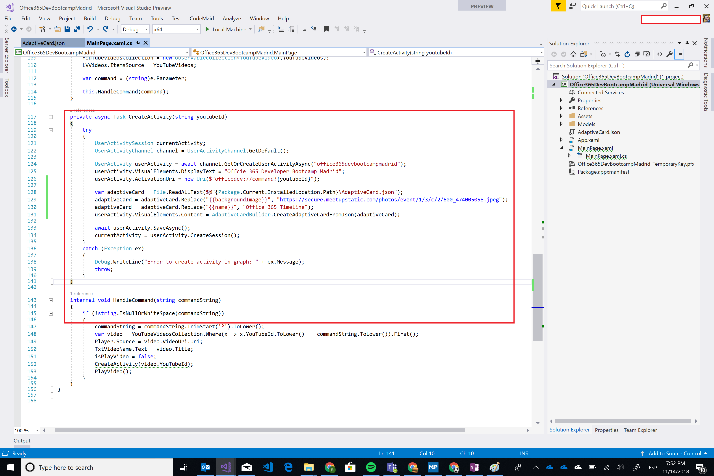  ´

Hacer un clean de la solución y ejecutarla.  
Para finalizar, ir a **Timeline** y vereis que la tarjeta ha cambiado  

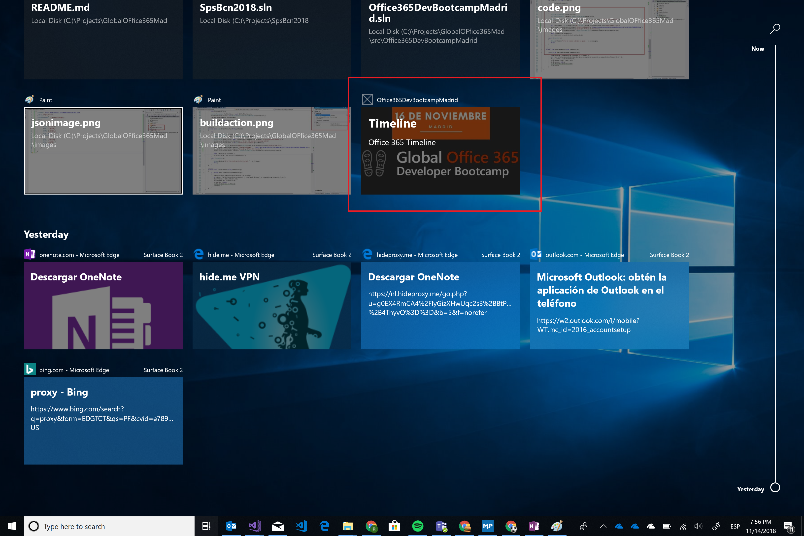  

    