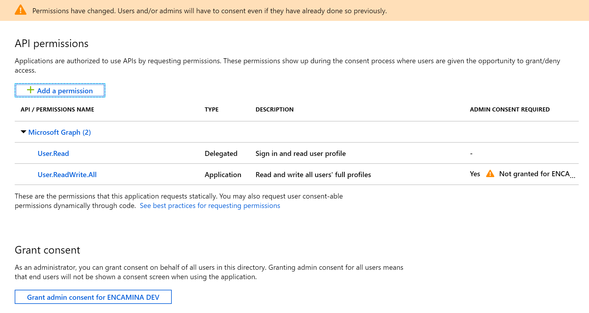
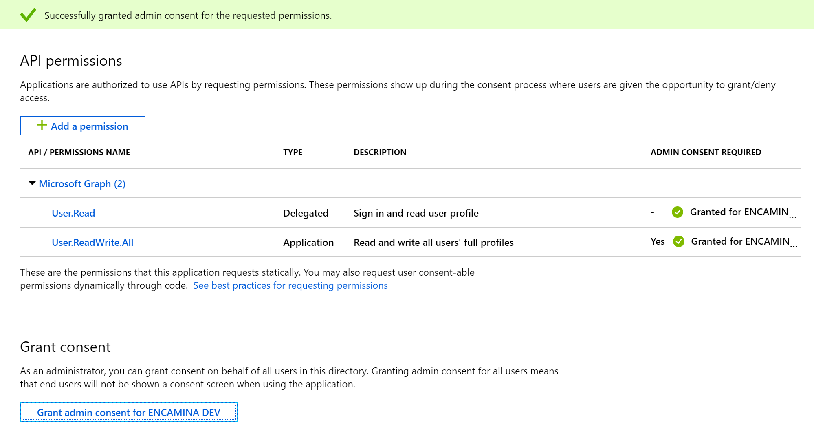
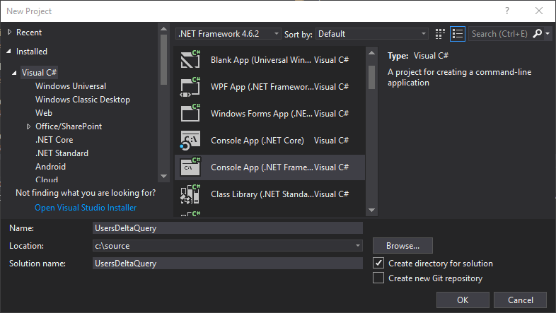
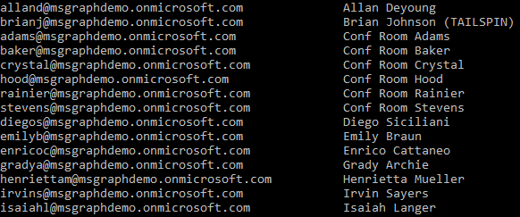
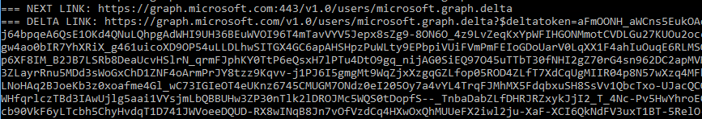
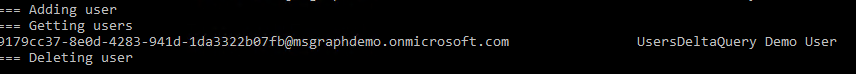

# Microsoft Graph delta queries

This demo will walk you through developing an application using delta queries with Microsoft Graph to request changes to resources.

## Prerequisites

This demo uses **Visual Studio 2017**. It also requires an **Microsoft Office 365 subscription** and a user with administrative privileges as well as a **Microsoft Azure subscription**. If you do not have an Microsoft Azure subscription, get started by creating a [free Microsoft Azure subscription](https://azure.microsoft.com/free).

## Register and grant consent to the application

1. Visit the [Preview Application Registration Portal](https://aka.ms/RegisteredAppsProd). Register a new converged application, as native application with a URI and copy the generated app ID for later use.

1. You will need to configure the application. Generate a new application password secret. Copy it for later use.

1. Copy the generated URL for later use.

1. Add an API permission selecting Microsoft Graph, Application Permissions for the `User.ReadWrite.All` scope.

1. Save your changes.

    

1. The application requests an application permission with the `User.ReadWrite.All` scope. This permission requires administrative consent. CLick on "Grant admin consent for..." button to apply those permissions.



## Create a new console application

1. In **Visual Studio 2017**, create a new console application named **UsersDeltaQuery**.

    

1. Right-click the project and choose **Manage NuGet Packages**.

1. Select the **Browse** tab in the **NuGet Package Manager** window. Ensure the **Include prerelease** checkbox is checked.

1. Search for and install the following NuGet packages:
    - `Microsoft.Graph`
    - `Microsoft.Identity.Client`

1. Right-click the **References** node in the project and choose **Add Reference**.

1. Add a reference for `System.Configuration`.

1. Edit the **App.config** file and provide the settings from your registered application.

    ```xml
    <add key="clientId" value="" />         <!-- ex: c7d838fa-8885-442d-889c-7d25567dd2c1 -->
    <add key="clientSecret" value="" />     <!-- ex: ehY7gK57f!29 -->
    <add key="tenantId" value="" />         <!-- ex: contoso.onmicrosoft.com -->
    <add key="authorityFormat" value="https://login.microsoftonline.com/{0}/v2.0" />
    <add key="replyUri" value="" />         <!-- ex: myapp://auth -->
    ```

1. Edit the **Program.cs** file and replace its contents.

    ```csharp
    using Microsoft.Graph;
    using Microsoft.Identity.Client;
    using System;
    using System.Configuration;
    using System.Net.Http.Headers;
    using System.Threading.Tasks;

    namespace UsersDeltaQuery
    {
        class Program
        {
            static void Main(string[] args)
            {
                RunAsync(args).GetAwaiter().GetResult();
                Console.WriteLine("Press any key to finish.");
                Console.ReadKey();
            }

            static async Task RunAsync(string[] args)
            {

                var clientId = ConfigurationManager.AppSettings["clientId"];
                var tenantId = ConfigurationManager.AppSettings["tenantId"];
                var authorityFormat = ConfigurationManager.AppSettings["authorityFormat"];

                ConfidentialClientApplication daemonClient = new ConfidentialClientApplication(
                    ConfigurationManager.AppSettings["clientId"],
                    String.Format(authorityFormat, tenantId),
                    ConfigurationManager.AppSettings["replyUri"],
                    new ClientCredential(ConfigurationManager.AppSettings["clientSecret"]),
                    null,
                                        new TokenCache());

                GraphServiceClient graphClient = new GraphServiceClient(
                    "https://graph.microsoft.com/v1.0",
                    new DelegateAuthenticationProvider(
                        async (requestMessage) =>
                        {
                            var authenticationResult = await daemonClient.AcquireTokenForClientAsync(new string[] { "https://graph.microsoft.com/.default" });
                            requestMessage.Headers.Authorization = new AuthenticationHeaderValue("bearer", authenticationResult.AccessToken);
                        }));

                Console.WriteLine("=== Getting users");

                //Get the list of changed users
                var userPage = await graphClient.Users
                    .Delta()
                    .Request()
                    .Select("displayName,userPrincipalName")
                    .GetAsync();

                //Display users and get the delta link
                var deltaLink = await DisplayChangedUsersAndGetDeltaLink(userPage);

                Console.WriteLine("=== Adding user");

                //Create a new user
                var u = new User()
                {
                    DisplayName = "UsersDeltaQuery Demo User",
                    GivenName = "UsersDeltaQueryDemo",
                    Surname = "User",
                    MailNickname = "UsersDeltaQueryDemoUser",
                    UserPrincipalName = Guid.NewGuid().ToString() + "@" + tenantId,
                    PasswordProfile = new PasswordProfile() { ForceChangePasswordNextSignIn = true, Password = "D3m0p@55w0rd!" },
                    AccountEnabled = true
                };
                var newUser = await graphClient.Users.Request().AddAsync(u);

                Console.WriteLine("Press any key to execute delta query.");
                Console.ReadKey();
                Console.WriteLine("=== Getting users");

                //Query using the delta link to see the new user
                userPage.InitializeNextPageRequest(graphClient, deltaLink);
                userPage = await userPage.NextPageRequest.GetAsync();

                //Display again... notice that only the added user is returned
                var newDeltaLink = await DisplayChangedUsersAndGetDeltaLink(userPage);
                while(deltaLink.Equals(newDeltaLink))
                {
                    //If the two are equal, then we didn't receive changes yet
                    //Query using the delta link to see the new user
                    userPage.InitializeNextPageRequest(graphClient, deltaLink);
                    userPage = await userPage.NextPageRequest.GetAsync();
                    newDeltaLink = await DisplayChangedUsersAndGetDeltaLink(userPage);
                }

                Console.WriteLine("=== Deleting user");
                //Finally, delete the user
                await graphClient.Users[newUser.Id].Request().DeleteAsync();

            }

            static async Task<string> DisplayChangedUsersAndGetDeltaLink(IUserDeltaCollectionPage userPage)
            {

                //Iterate through the users
                foreach (var user in userPage)
                {
                    if(user.UserPrincipalName != null)
                    Console.WriteLine(user.UserPrincipalName.ToLower().Replace("m365x287476","msgraphdemo") + "\t\t" + user.DisplayName);
                }
                while (userPage.NextPageRequest != null)
                {
                    //Console.WriteLine("=== NEXT LINK: " + userPage.NextPageRequest.RequestUrl);
                    //Console.WriteLine("=== SKIP TOKEN: " + userPage.NextPageRequest.QueryOptions[0].Value);

                    userPage = await userPage.NextPageRequest.GetAsync();
                    foreach (var user in userPage)
                    {
                        if (user.UserPrincipalName != null)
                            Console.WriteLine(user.UserPrincipalName.ToLower().Replace("m365x287476", "msgraphdemo") + "\t\t" + user.DisplayName);
                    }
                }

                //Finally, get the delta link
                string deltaLink = (string)userPage.AdditionalData["@odata.deltaLink"];
                //Console.WriteLine("=== DELTA LINK: " + deltaLink);

                return deltaLink;
            }
        }
    }

    ```

## Run the application

1. Run the application. Your application will make a delta query request to Microsoft Graph for users. The first query will return all users because you do not yet have a deltaLink to query.

    

1. In order to force a change, you will add a new user using the Microsoft Graph API. Because these are asynchronous methods, the code execution will pause waiting for you to press a key to continue. This allows you to verify that the newly created `UsersDeltaQuery Demo User` user has been added to your tenant before executing the delta query.

    You can un-comment the lines in the method that displays the user data to also show the `nextLink`, `skipToken`, and `deltaLink` values.

    

1. Another delta query request is made to the Microsoft Graph against the users resource, this time using the `deltaQuery`. Only the newly added user is returned.

    

1. Finally, the newly created user is deleted.