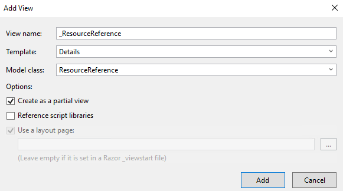
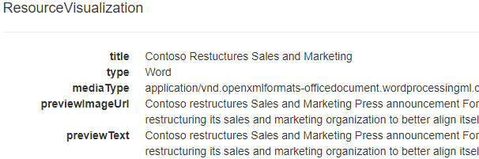

# Developing insights with Microsoft Graph

This lab will show how to use the Insights resource with Microsoft Graph.

## Register the application

1. Visit the [Application Registration Portal](https://apps.dev.microsoft.com) and register a new converged application. Copy the generated app ID for later use as the Client ID.

1. Add a new app secret by selecting the **Generate new password** button and copying the secret to use later as the Client Secret.

1. Select the **Add Platform** button.

1. In the dialog box, choose **Web**.

1. Add a **Redirect URL** to use while debugging locally. The default setting for the Visual Studio project is `https://localhost:44326/`. If you use something else you need to change this value for your app registration.

1. Save all changes.

## Clone the starting application

1. The application will use OpenId Connect with the Azure AD v2.0 endpoint as a starting point. To start, you will clone the project from **GitHub**. From your shell or command line:

    ```shell
    git clone https://github.com/Azure-Samples/active-directory-dotnet-webapp-openidconnect-v2.git
    ```

1. Open the project with **Visual Studio 2017**.

1. Edit the **web.config** file with your app's coordinates. Find the appSettings key `ida:ClientId` and provide the app ID from your app registration. Find the appSettings key `ida:ClientSecret` and provide the value from the app secret generated in the previous step.

1. The insights resource requires the `Sites.Read.All` delegated permission. Edit the `App_Start/Startup.Auth.cs` file and edit the scope parameter to include the `Sites.Read.All` permission scope in the space-delimited list.

    ```csharp
    Scope = "openid email profile offline_access Mail.Read Sites.Read.All",
    ```

1. The application will de-serialize JSON data returned from Microsoft Graph into strongly-typed classes.  Right-click the **Models** folder and add a new class **Insights.cs**.

1. Replace the contents of **Insights.cs** with the following:

    ```csharp
    using Newtonsoft.Json;
    using System;
    using System.Collections.Generic;

    public class ResourceVisualization
    {

        [JsonProperty("title")]
        public string title { get; set; }

        [JsonProperty("type")]
        public string type { get; set; }

        [JsonProperty("mediaType")]
        public string mediaType { get; set; }

        [JsonProperty("previewImageUrl")]
        public string previewImageUrl { get; set; }

        [JsonProperty("previewText")]
        public string previewText { get; set; }

        [JsonProperty("containerWebUrl")]
        public string containerWebUrl { get; set; }

        [JsonProperty("containerDisplayName")]
        public string containerDisplayName { get; set; }

        [JsonProperty("containerType")]
        public string containerType { get; set; }
    }

    public class ResourceReference
    {

        [JsonProperty("webUrl")]
        public string webUrl { get; set; }

        [JsonProperty("id")]
        public string id { get; set; }

        [JsonProperty("type")]
        public string type { get; set; }
    }

    public class TrendingInsights
    {

        [JsonProperty("@odata.context")]
        public string context { get; set; }

        [JsonProperty("value")]
        public IList<TrendingValue> value { get; set; }
    }

    public class TrendingValue
    {

        [JsonProperty("id")]
        public string id { get; set; }

        [JsonProperty("weight")]
        public double weight { get; set; }

        [JsonProperty("resourceVisualization")]
        public ResourceVisualization resourceVisualization { get; set; }

        [JsonProperty("resourceReference")]
        public ResourceReference resourceReference { get; set; }
    }

    public class SharedInsights
    {

        [JsonProperty("@odata.context")]
        public string context { get; set; }

        [JsonProperty("value")]
        public IList<SharedValue> value { get; set; }
    }

    public class SharedValue
    {

        [JsonProperty("id")]
        public string id { get; set; }

        [JsonProperty("lastShared")]
        public LastShared lastShared { get; set; }

        [JsonProperty("resourceVisualization")]
        public ResourceVisualization resourceVisualization { get; set; }

        [JsonProperty("resourceReference")]
        public ResourceReference resourceReference { get; set; }
    }

    public class SharedBy
    {

        [JsonProperty("displayName")]
        public string displayName { get; set; }

        [JsonProperty("address")]
        public string address { get; set; }

        [JsonProperty("id")]
        public string id { get; set; }
    }

    public class SharingReference
    {

        [JsonProperty("webUrl")]
        public string webUrl { get; set; }

        [JsonProperty("id")]
        public string id { get; set; }

        [JsonProperty("type")]
        public string type { get; set; }
    }

    public class LastShared
    {

        [JsonProperty("sharedDateTime")]
        public DateTime sharedDateTime { get; set; }

        [JsonProperty("sharingSubject")]
        public string sharingSubject { get; set; }

        [JsonProperty("sharingType")]
        public string sharingType { get; set; }

        [JsonProperty("sharedBy")]
        public SharedBy sharedBy { get; set; }

        [JsonProperty("sharingReference")]
        public SharingReference sharingReference { get; set; }
    }

    public class UsedInsights
    {

        [JsonProperty("@odata.context")]
        public string context { get; set; }

        [JsonProperty("value")]
        public IList<LastUsedValue> value { get; set; }
    }

    public class LastUsedValue
    {

        [JsonProperty("id")]
        public string id { get; set; }

        [JsonProperty("lastUsed")]
        public LastUsed lastUsed { get; set; }

        [JsonProperty("resourceVisualization")]
        public ResourceVisualization resourceVisualization { get; set; }

        [JsonProperty("resourceReference")]
        public ResourceReference resourceReference { get; set; }
    }

    public class LastUsed
    {

        [JsonProperty("lastAccessedDateTime")]
        public DateTime lastAccessedDateTime { get; set; }

        [JsonProperty("lastModifiedDateTime")]
        public DateTime lastModifiedDateTime { get; set; }
    }
    ```

1. Right-click the **Controllers** folder, choose **Add > Controller**, choose the **MVC 5 Controller Empty** project item template, and name the new controller `InsightsController`.

1. Replace the contents of **InsightsController.cs** with the following:

    ```csharp
    using Microsoft.Identity.Client;
    using Newtonsoft.Json;
    using System;
    using System.Collections.Generic;
    using System.Configuration;
    using System.Linq;
    using System.Net.Http;
    using System.Net.Http.Headers;
    using System.Security.Claims;
    using System.Threading.Tasks;
    using System.Web;
    using System.Web.Mvc;
    using WebApp_OpenIDConnect_DotNet.Models;

    namespace WebApp.Controllers
    {
        public class InsightsController : Controller
        {
            public static string clientId = ConfigurationManager.AppSettings["ida:ClientId"];
            private static string appKey = ConfigurationManager.AppSettings["ida:ClientSecret"];
            private static string redirectUri = ConfigurationManager.AppSettings["ida:RedirectUri"];

            // GET: Insights
            public async Task<ActionResult> Index()
            {
                return View();
            }

            [Authorize]
            public async Task<ActionResult> Shared()
            {
                var ret = new SharedInsights();

                HttpClient client = new HttpClient();
                HttpRequestMessage request = new HttpRequestMessage(HttpMethod.Get, "https://graph.microsoft.com/beta/me/insights/shared");

                // try to get token silently
                string signedInUserID = ClaimsPrincipal.Current.FindFirst(ClaimTypes.NameIdentifier).Value;
                TokenCache userTokenCache = new MSALSessionCache(signedInUserID, this.HttpContext).GetMsalCacheInstance();
                ConfidentialClientApplication cca = new ConfidentialClientApplication(clientId, redirectUri,new ClientCredential(appKey), userTokenCache, null);
                var accounts = await cca.GetAccountsAsync();
                if (accounts.Any())
                {
                    string[] scopes = { "Sites.Read.All" };
                    try
                    {
                        AuthenticationResult result = await cca.AcquireTokenSilentAsync(scopes, accounts.First());

                        request.Headers.Authorization = new AuthenticationHeaderValue("Bearer", result.AccessToken);
                        HttpResponseMessage response = await client.SendAsync(request);

                        if (response.IsSuccessStatusCode)
                        {
                            ViewBag.AuthorizationRequest = null;
                            var responseBody = await response.Content.ReadAsStringAsync();
                            ret = JsonConvert.DeserializeObject<SharedInsights>(responseBody);
                        }
                    }
                    catch (MsalUiRequiredException)
                    {
                        try
                        {// when failing, manufacture the URL and assign it
                            string authReqUrl = await WebApp.Utils.OAuth2RequestManager.GenerateAuthorizationRequestUrl(scopes, cca, this.HttpContext, Url);
                            ViewBag.AuthorizationRequest = authReqUrl;
                        }
                        catch (Exception ee)
                        {
                            Response.Write(ee.Message);
                        }
                    }
                }
                else { }
                return View(ret);
            }

            [Authorize]
            public async Task<ActionResult> Trending()
            {
                var ret = new TrendingInsights();
                HttpClient client = new HttpClient();
                HttpRequestMessage request = new HttpRequestMessage(HttpMethod.Get, "https://graph.microsoft.com/beta/me/insights/trending");

                // try to get token silently
                string signedInUserID = ClaimsPrincipal.Current.FindFirst(ClaimTypes.NameIdentifier).Value;
                TokenCache userTokenCache = new MSALSessionCache(signedInUserID, this.HttpContext).GetMsalCacheInstance();
                ConfidentialClientApplication cca = new ConfidentialClientApplication(clientId, redirectUri,new ClientCredential(appKey), userTokenCache, null);
                var accounts = await cca.GetAccountsAsync();
                if (accounts.Any())
                {
                    string[] scopes = { "Sites.Read.All" };
                    try
                    {
                        AuthenticationResult result = await cca.AcquireTokenSilentAsync(scopes, accounts.First());

                        request.Headers.Authorization = new AuthenticationHeaderValue("Bearer", result.AccessToken);
                        HttpResponseMessage response = await client.SendAsync(request);

                        if (response.IsSuccessStatusCode)
                        {
                            var responseBody = await response.Content.ReadAsStringAsync();
                            ret = JsonConvert.DeserializeObject<TrendingInsights>(responseBody);
                            ViewBag.AuthorizationRequest = null;
                        }
                    }
                    catch (MsalUiRequiredException)
                    {
                        try
                        {// when failing, manufacture the URL and assign it
                            string authReqUrl = await WebApp.Utils.OAuth2RequestManager.GenerateAuthorizationRequestUrl(scopes, cca, this.HttpContext, Url);
                            ViewBag.AuthorizationRequest = authReqUrl;
                        }
                        catch (Exception ee)
                        {
                            Response.Write(ee.Message);
                        }
                    }
                }
                else { }
                return View(ret);
            }

            [Authorize]
            public async Task<ActionResult> Used()
            {
                var ret = new UsedInsights();

                HttpClient client = new HttpClient();
                HttpRequestMessage request = new HttpRequestMessage(HttpMethod.Get, "https://graph.microsoft.com/beta/me/insights/used");

                // try to get token silently
                string signedInUserID = ClaimsPrincipal.Current.FindFirst(ClaimTypes.NameIdentifier).Value;
                TokenCache userTokenCache = new MSALSessionCache(signedInUserID, this.HttpContext).GetMsalCacheInstance();
                ConfidentialClientApplication cca = new ConfidentialClientApplication(clientId, redirectUri,new ClientCredential(appKey), userTokenCache, null);
                var accounts = await cca.GetAccountsAsync();
                if (accounts.Any())
                {
                    string[] scopes = { "Sites.Read.All" };
                    try
                    {
                        AuthenticationResult result = await cca.AcquireTokenSilentAsync(scopes, accounts.First());

                        request.Headers.Authorization = new AuthenticationHeaderValue("Bearer", result.AccessToken);
                        HttpResponseMessage response = await client.SendAsync(request);

                        if (response.IsSuccessStatusCode)
                        {
                            var responseBody = await response.Content.ReadAsStringAsync();
                            ret = JsonConvert.DeserializeObject<UsedInsights>(responseBody);

                            ViewBag.AuthorizationRequest = null;
                        }
                    }
                    catch (MsalUiRequiredException)
                    {
                        try
                        {// when failing, manufacture the URL and assign it
                            string authReqUrl = await WebApp.Utils.OAuth2RequestManager.GenerateAuthorizationRequestUrl(scopes, cca, this.HttpContext, Url);
                            ViewBag.AuthorizationRequest = authReqUrl;
                        }
                        catch (Exception ee)
                        {
                            Response.Write(ee.Message);
                        }
                    }
                }
                else { }
                return View(ret);
            }
        }
    }
    ```

1. Each controller method returns a different model to use with its view. Right-click the **Views/Insights** folder and choose **Add > View**.

1. Add four empty views:
    - `Index.cshtml`
    - `Shared.cshtml`
    - `Trending.cshtml`
    - `Used.cshtml`

1. Replace the contents of **Index.cshtml** with the following:

    ```html
    @{
        ViewBag.Title = "Index";
    }

    <h2>Index</h2>

    @Html.ActionLink("View trending", "Trending")

    @Html.ActionLink("View shared", "Shared")

    @Html.ActionLink("View used", "Used")
    ```

1. Replace the contents of **Shared.cshtml** with the following:

    ```html
    @model SharedInsights

    @{
        ViewBag.Title = "Shared";
    }

    <h2>Shared</h2>

    <div>
        <h4>SharedInsights</h4>
        <hr />
        <dl class="dl-horizontal">
            <dt>
                @Html.DisplayNameFor(model => model.context)
            </dt>

            <dd>
                @Html.DisplayFor(model => model.context)
            </dd>

            @foreach (var item in Model.value)
            {

                <dt>
                    @Html.DisplayNameFor(modelItem => item.id)
                </dt>
                <dd>
                    @Html.DisplayFor(modelItem => item.id)
                </dd>
                <dt>
                    @Html.DisplayNameFor(modelItem => item.lastShared.sharedBy)
                </dt>
                <dd>
                    @Html.DisplayFor(modelItem => item.lastShared.sharedBy)
                </dd>
                <dt>
                    @Html.DisplayNameFor(modelItem => item.lastShared.sharedDateTime)
                </dt>
                <dd>
                    @Html.DisplayFor(modelItem => item.lastShared.sharedDateTime)
                </dd>
                <dt>
                    @Html.DisplayNameFor(modelItem => item.lastShared.sharingSubject)
                </dt>
                <dd>
                    @Html.DisplayFor(modelItem => item.lastShared.sharingSubject)
                </dd>
                <dt>
                    @Html.DisplayNameFor(modelItem => item.lastShared.sharingType)
                </dt>
                <dd>
                    @Html.DisplayFor(modelItem => item.lastShared.sharingType)
                </dd>
                <dt>
                    @Html.DisplayNameFor(modelItem => item.lastShared.sharingReference.id)
                </dt>
                <dd>
                    @Html.DisplayFor(modelItem => item.lastShared.sharingReference.id)
                </dd>
                <dt>
                    @Html.DisplayNameFor(modelItem => item.lastShared.sharingReference.type)
                </dt>
                <dd>
                    @Html.DisplayFor(modelItem => item.lastShared.sharingReference.type)
                </dd>
                <dt>
                    @Html.DisplayNameFor(modelItem => item.lastShared.sharingReference.webUrl)
                </dt>
                <dd>
                    @Html.DisplayFor(modelItem => item.lastShared.sharingReference.webUrl)
                </dd>

                <dt>
                    @Html.DisplayNameFor(modelItem => item.lastShared.sharedBy)
                </dt>
                <dd>
                    @Html.DisplayFor(modelItem => item.lastShared.sharedBy)
                </dd>
                @Html.Partial("_ResourceReference", item.resourceReference)
                @Html.Partial("_ResourceVisualization", item.resourceVisualization)
            }
        </dl>
    </div>
    <p>
        @Html.ActionLink("Back to List", "Index")
    </p>
    ```

1. Replace the contents of **Trending.cshtml** with the following:

    ```html
    @model TrendingInsights

    @{
        ViewBag.Title = "Trending";
    }

    <h2>Trending</h2>

    <div>
        <h4>TrendingInsights</h4>
        <hr />
        <dl class="dl-horizontal">
            <dt>
                @Html.DisplayNameFor(model => model.context)
            </dt>

            <dd>
                @Html.DisplayFor(model => model.context)
            </dd>

            @foreach (var item in Model.value)
            {

                <dt>
                    @Html.DisplayNameFor(modelItem => item.id)
                </dt>
                <dd>
                    @Html.DisplayFor(modelItem => item.id)
                </dd>
                <dt>
                    @Html.DisplayNameFor(modelItem => item.weight)
                </dt>
                <dd>
                    @Html.DisplayFor(modelItem => item.weight)
                </dd>
                @Html.Partial("_ResourceReference", item.resourceReference)
                @Html.Partial("_ResourceVisualization", item.resourceVisualization)
            }

        </dl>
    </div>
    <p>
        @Html.ActionLink("Back to List", "Index")
    </p>
    ```

1. Replace the contents of **Used.cshtml** with the following:

    ```html
    @model UsedInsights

    @{
        ViewBag.Title = "Used";
    }

    <h2>Used</h2>

    <div>
        <h4>UsedInsights</h4>
        <hr />
        <dl class="dl-horizontal">
            <dt>
                @Html.DisplayNameFor(model => model.context)
            </dt>

            <dd>
                @Html.DisplayFor(model => model.context)
            </dd>
    @foreach (var item in Model.value)
    {

        <dt>
            @Html.DisplayNameFor(modelItem => item.id)
        </dt>
                <dd>
                    @Html.DisplayFor(modelItem => item.id)
                </dd>
                <dt>
                    @Html.DisplayNameFor(modelItem => item.lastUsed)
                </dt>
                <dd>
                    @Html.DisplayFor(modelItem => item.lastUsed)
                </dd>

                @Html.Partial("_ResourceReference", item.resourceReference)
                @Html.Partial("_ResourceVisualization", item.resourceVisualization)
    }
        </dl>
    </div>
    <p>
        @Html.ActionLink("Back to List", "Index")
    </p>
    ```

1. Each of these views uses two partial views, `_ResourceReference` and `_ResourceVisualization`. Partial views make it easy to encapsulate code that is common across multiple views. Right-click the **Views / Shared** folder and choose **Add > View**.

1. Name the new view **_ResourceReference**, change the template to **Details**, and change the model class to **ResourceReference**.

1. Check the **Create as partial view** checkbox and select **Add**.

    

1. Repeat these steps to add a partial view for `_ResourceVisualization`. Name the new view `_ResourceVisualization`.

1. Change the template to **Details** and change the model class to **ResourceVisualization**.

1. Check the **Create as partial view** checkbox and select **Add**.

1. Update the top-level navigation for the web site by editing the **Views / Shared / _Layout.cshtml** file and add a link to the new controller.

    ```html
    <li>@Html.ActionLink("Read Mail", "ReadMail", "Home")</li>
    <li>@Html.ActionLink("Send Mail", "SendMail", "Home")</li>
    <li>@Html.ActionLink("Insights", "Index", "Insights")</li>
    ```

## Run the application

1. Run the application. Select **Sign in with Microsoft**. Sign in and to grant the application the requested permissions. After consenting, the page is displayed.

1. Select the **Insights** link at the top of the page, then choose the **View Trending** link. The information is displayed.

    

1. The image for the **previewImage** is not displaying. You must first log into your SharePoint site to see data. Open a new tab in the browser and navigate to your SharePoint site. Now, go back to the page and refresh, you will see the images appear.
