# Microsoft Graph Capabilities

In this lab, you will walk through capabilities of the Microsoft Graph to build applications to understand the capabilities of Microsoft Graph.

## Table of Contents

1. [Microsoft Graph delta queries](#1._Microsoft_Graph_delta_queries)
1. [Microsoft Graph webhooks](#2._Microsoft_Graph_webhooks)
1. [Adding custom data to resources in Microsoft Graph](#3._Adding_custom_data_to_resources_in_Microsoft_Graph])
1. [Developing Insights with Microsoft Graph](#4._Developing_Insights_with_Microsoft_Graph)
1. [Creating batch requests with Microsoft Graph](#5._Creating_batch_requests_with_Microsoft_Graph)

## Prerequisites

This lab uses Visual Studio 2017. It also requires an Office 365 subscription and a user with administrative privileges. This lab also requires a Microsoft Azure subscription. If you do not have an Azure subscription, get started by creating a [Free Azure Subscription](https://azure.microsoft.com/free).

## 1. Microsoft Graph delta queries

This lab will walk you through developing an application using delta queries with Microsoft Graph to request changes to resources.

### Register and grant consent to the Graph delta queries application

Visit the [Application Registration Portal](https://apps.dev.microsoft.com). **Register** a new Converged application, and copy the generated application ID for later use.  **Configure** the application:

- **Generate** a new application password secret. Copy it for later use.
- Add a **Native** application platform. Copy the generated URL for later use.
- Add a **Web** application platform. Set the `Redirect URLs` to <http://localhost>
- Add an **application** permission for the `User.ReadWrite.All` scope.
- Make sure to **Save** all changes

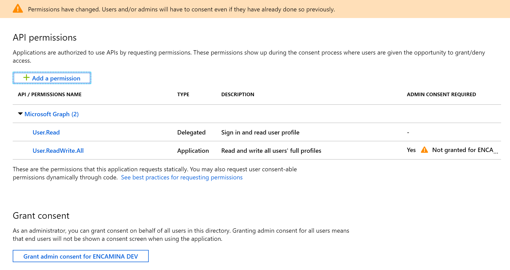

The application requests an application permission with the User.ReadWrite.All scope. This permission requires administrative consent. **Copy** the following URL and **replace** the `{clientId}` placeholder with your application's client ID from the application registration portal.

````html
https://login.microsoftonline.com/common/adminconsent?client_id={clientId}&redirect_uri=http://localhost
````

**Paste** the resulting URL into a browser. You are prompted to sign in. You must sign in as an administrative user.

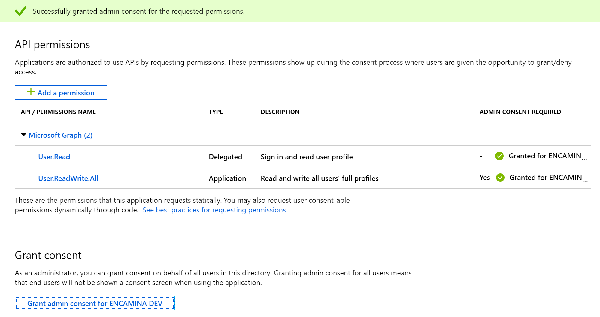

After signing in, you are prompted to consent to permission requests to read and write all users' full profiles and to sign in and read the current user's profile. Click **Accept**.

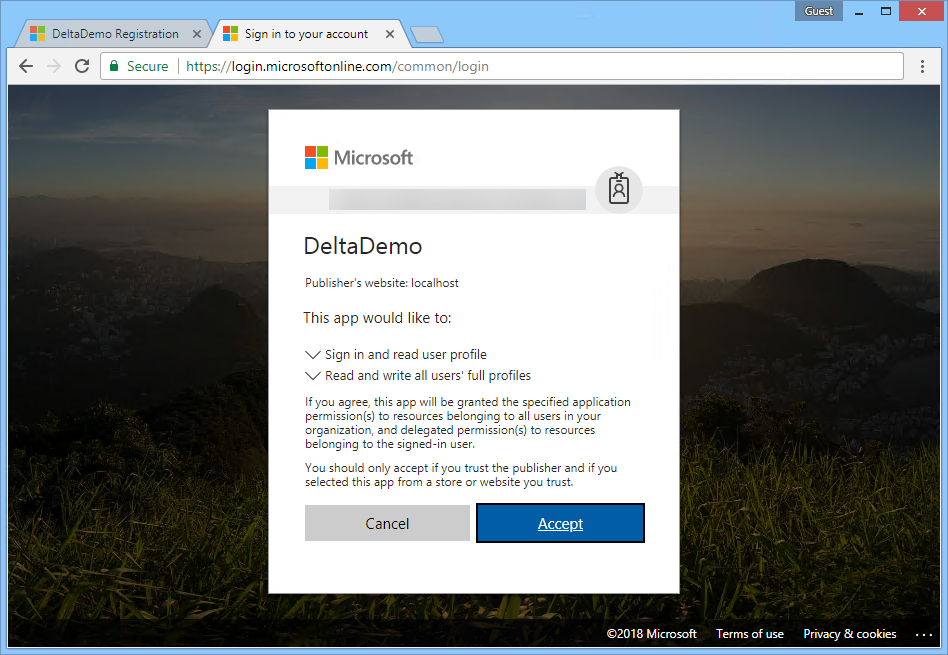

> **Note:** There is approximately a 20 minute data replication delay between the time when an application is granted admin consent and when the data can successfully synchronize. For more information, see: <https://github.com/Azure-Samples/active-directory-dotnet-daemon-v2/issues/1>

You will receive an error indicating a bad request. This is expected. You did not create a web application to listen for HTTP requests on localhost, Azure AD is telling you that it cannot redirect to the requested URL. Building a web application for admin consent is out of scope for this lab. However, the URL in the browser shows that Azure AD is telling you that admin consent has been granted via the "admin_consent=True" in the URL bar.

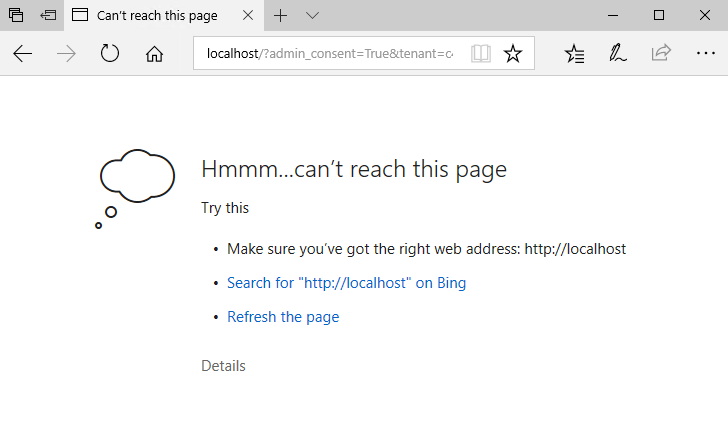

### Create a new console application

In Visual Studio 2017, create a new console application named **UsersDeltaQuery**.

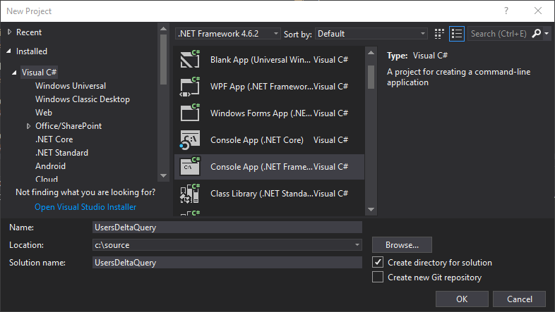

**Right-click** the project and choose **Manage NuGet Packages**.

Click the **Browse** tab in the NuGet Package Manager window. Ensure the **Include pre-release** checkbox is checked.

**Search** for and install the following NuGet packages:

- `Microsoft.Graph`
- `Microsoft.Identity.Client`

>Note: Please select version 1.1.4-preview0002 of the Microsoft.Identity.Client.

**Right-click** the References node in the project and choose **Add Reference**. **Add** a reference for `System.Configuration`.

**Edit** the `App.config` file and provide the settings from your registered application.

````xml
<add key="clientId" value="" />         <!-- ex: c7d838fa-8885-442d-889c-7d25567dd2c1 -->
<add key="clientSecret" value="" />     <!-- ex: ehY7gK57f!29 -->
<add key="tenantId" value="" />         <!-- ex: contoso.onmicrosoft.com -->
````

**Edit** the `Program.cs` file and replace its contents.

````csharp
using Microsoft.Graph;
using Microsoft.Identity.Client;
using System;
using System.Configuration;
using System.Net.Http.Headers;
using System.Threading.Tasks;

namespace UsersDeltaQuery
{
    class Program
    {
        static void Main(string[] args)
        {
            RunAsync(args).GetAwaiter().GetResult();
            Console.WriteLine("Press any key to finish.");
            Console.ReadKey();
        }

        static async Task RunAsync(string[] args)
        {

            var clientId = ConfigurationManager.AppSettings["clientId"];
            var tenantId = ConfigurationManager.AppSettings["tenantId"];
            var authorityFormat = ConfigurationManager.AppSettings["authorityFormat"];

            ConfidentialClientApplication daemonClient = new ConfidentialClientApplication(
                ConfigurationManager.AppSettings["clientId"],
                String.Format(authorityFormat, tenantId),
                ConfigurationManager.AppSettings["replyUri"],
                new ClientCredential(ConfigurationManager.AppSettings["clientSecret"]),
                null,
                new TokenCache());


            GraphServiceClient graphClient = new GraphServiceClient(
                "https://graph.microsoft.com/v1.0",
                new DelegateAuthenticationProvider(
                    async (requestMessage) =>
                    {
                        var authenticationResult = await daemonClient.AcquireTokenForClientAsync(new string[] { "https://graph.microsoft.com/.default" });
                        requestMessage.Headers.Authorization = new AuthenticationHeaderValue("bearer", authenticationResult.AccessToken);
                    }));

            Console.WriteLine("=== Getting users");

            //Get the list of changed users
            var userPage = await graphClient.Users
                .Delta()
                .Request()
                .Select("displayName,userPrincipalName")
                .GetAsync();

            //Display users and get the delta link
            var deltaLink = await DisplayChangedUsersAndGetDeltaLink(userPage);

            Console.WriteLine("=== Adding user");

            //Create a new user
            var u = new User()
            {
                DisplayName = "UsersDeltaQuery Demo User",
                GivenName = "UsersDeltaQueryDemo",
                 Surname = "User",
                 MailNickname = "UsersDeltaQueryDemoUser",
                 UserPrincipalName = Guid.NewGuid().ToString() + "@" + tenantId,
                PasswordProfile = new PasswordProfile() { ForceChangePasswordNextSignIn = true, Password = "D3m0p@55w0rd!" },
                AccountEnabled = true
            };
            var newUser = await graphClient.Users.Request().AddAsync(u);

            Console.WriteLine("Press any key to execute delta query.");
            Console.ReadKey();
            Console.WriteLine("=== Getting users");

            //Query using the delta link to see the new user
            userPage.InitializeNextPageRequest(graphClient, deltaLink);
            userPage = await userPage.NextPageRequest.GetAsync();

            //Display again... notice that only the added user is returned
            var newDeltaLink = await DisplayChangedUsersAndGetDeltaLink(userPage);
            while(deltaLink.Equals(newDeltaLink))
            {
                //If the two are equal, then we didn't receive changes yet
                //Query using the delta link to see the new user
                userPage.InitializeNextPageRequest(graphClient, deltaLink);
                userPage = await userPage.NextPageRequest.GetAsync();
                newDeltaLink = await DisplayChangedUsersAndGetDeltaLink(userPage);
            }

            Console.WriteLine("=== Deleting user");
            //Finally, delete the user
            await graphClient.Users[newUser.Id].Request().DeleteAsync();

        }

        static async Task<string> DisplayChangedUsersAndGetDeltaLink(IUserDeltaCollectionPage userPage)
        {

            //Iterate through the users
            foreach (var user in userPage)
            {
                if(user.UserPrincipalName != null)
                Console.WriteLine(user.UserPrincipalName.ToLower().Replace("m365x287476","msgraphdemo") + "\t\t" + user.DisplayName);
            }
            while (userPage.NextPageRequest != null)
            {
                //Console.WriteLine("=== NEXT LINK: " + userPage.NextPageRequest.RequestUrl);
                //Console.WriteLine("=== SKIP TOKEN: " + userPage.NextPageRequest.QueryOptions[0].Value);

                userPage = await userPage.NextPageRequest.GetAsync();
                foreach (var user in userPage)
                {
                    if (user.UserPrincipalName != null)
                        Console.WriteLine(user.UserPrincipalName.ToLower().Replace("m365x287476", "msgraphdemo") + "\t\t" + user.DisplayName);
                }
            }

            //Finally, get the delta link
            string deltaLink = (string)userPage.AdditionalData["@odata.deltaLink"];
            //Console.WriteLine("=== DELTA LINK: " + deltaLink);

            return deltaLink;
        }
    }
}

````

### Run the Microsoft Graph delta queries application

Now that the application is written and configured, run the application to test it and observe its behavior.

Your application will make a delta query request to the Microsoft Graph for users. The first query will return all users because you do not yet have a deltaLink to query.


In order to force a change, you will add a new user using the Microsoft Graph API. Because these are asynchronous methods the code execution will pause waiting for you to press a key to continue. This allows you to verify that the newly created `UsersDeltaQuery Demo User` user has been added to your tenant before executing the delta query.

You can un-comment the lines in the method that displays the user data to also show the nextLink, skipToken, and deltaLink values.

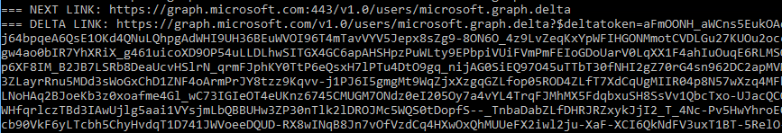

Another delta query request is made to the Microsoft Graph against the Users resource, this time using the deltaQuery. Only the newly added user is returned.


Finally, the newly created user is deleted.

## 2. Microsoft Graph webhooks

This lab will walk you through creating an application that uses OAuth with ASP.NET OWIN middleware and the v2.0 endpoint with Microsoft Graph to register subscriptions. You will also publish the application to a Microsoft Azure Web App to process notifications.

### Create the Azure Web App

Webhooks in Microsoft Graph require a publicly accessible endpoint such as a Microsoft Azure Web App or another web server. This lab uses Microsoft Azure. In the Azure portal, **create** a new Web App by clicking **+ Create a resource** then **Web + Mobile** then **Web App**. Provide a unique name, choose the subscription, and provide a resource group. Choose **Windows** as the OS type. **Edit** the app service plan. Provide the name, location, and change the Pricing tier to **Free**. Click **OK**, then **Create**.

Once the web app is created, copy the URL for later use.

### Register the Graph delta queries application

Visit the [Application Registration Portal](https://apps.dev.microsoft.com/). **Register** a new converged application, and copy the generated application ID for later use.  **Configure** the application:

- Add a new secret by clicking the **Generate new password** button and copy the secret to use later as the Client Secret.
- Click the **Add Platform** button. A popup is presented, choose **Web**.
- Add a Redirect URL to use while debugging locally (the default setting for the Visual Studio project is `https://localhost:44326/`, if you use something else you need to change this value for your app registration).
- Add a Redirect URL to use with your Azure Web App (ex: `https://YOURWEBAPP.azurewebsites.net/`).
- Click **Save** to save all changes.

### Clone the starting application

The application will use OpenId Connect with the v2.0 endpoint as a starting point. To start, you will clone the project from GitHub. From your shell or command line:

````shell
git clone https://github.com/Azure-Samples/active-directory-dotnet-webapp-openidconnect-v2.git
````

**Edit** the `web.config` file with your app's coordinates.

- Find the appSettings key `ida:ClientId` and provide the Application ID from your app registration.
- Find the appSettings key `ida:ClientSecret` and provide the value from the secret generated in the previous step.
- **Replace** the `ida:RedirectUrl` with the same value you provided in the application registration's Redirect URL for your Azure Web App (for example, `https://YOURWEBAPP.azurewebsites.net/`).
- **Add** a new appSettings key named `ida:NotificationUrl`, replacing `YOURWEBSITE` with the name of your newly created Azure Web App:

````xml
<add key="ida:NotificationUrl" value="https://YOURWEBSITE.azurewebsites.net/notification/listen" />
````

The application will need to send and receive emails on behalf of the currently logged in user. **Edit** the file `App_Start/Startup.Auth.cs` and update the Scope parameter in `ConfigureAuth` to include the Mail.Send permission scope. Append `Mail.Send` to the space-delimited list:

````csharp
Scope = "openid email profile offline_access Mail.Read Mail.Send",
````

### Add model classes

The application uses several new model classes for (de)serialization and for Razor views.

**Right-click** the `Models` folder and add five new classes:

- `Notification.cs`
- `ResourceData.cs`
- `Subscription.cs`
- `SubscriptionStore.cs`
- `SubscriptionViewModel.cs`

**Replace** the contents of `Notification.cs` with the following:

````csharp
using Newtonsoft.Json;
using System;

namespace WebApp.Models
{
    // A change notification.
    public class Notification
    {
        // The type of change.
        [JsonProperty(PropertyName = "changeType")]
        public string ChangeType { get; set; }

        // The client state used to verify that the notification is from Microsoft Graph. Compare the value received with the notification to the value you sent with the subscription request.
        [JsonProperty(PropertyName = "clientState")]
        public string ClientState { get; set; }

        // The endpoint of the resource that changed. For example, a message uses the format ../Users/{user-id}/Messages/{message-id}
        [JsonProperty(PropertyName = "resource")]
        public string Resource { get; set; }

        // The UTC date and time when the webhooks subscription expires.
        [JsonProperty(PropertyName = "subscriptionExpirationDateTime")]
        public DateTimeOffset SubscriptionExpirationDateTime { get; set; }

        // The unique identifier for the webhooks subscription.
        [JsonProperty(PropertyName = "subscriptionId")]
        public string SubscriptionId { get; set; }

        // Properties of the changed resource.
        [JsonProperty(PropertyName = "resourceData")]
        public ResourceData ResourceData { get; set; }
    }
}
````

**Replace** the contents of `ResourceData.cs` with the following:

````csharp
using Newtonsoft.Json;

namespace WebApp.Models
{
    public class ResourceData
    {

        // The ID of the resource.
        [JsonProperty(PropertyName = "id")]
        public string Id { get; set; }

        // The OData etag property.
        [JsonProperty(PropertyName = "@odata.etag")]
        public string ODataEtag { get; set; }

        // The OData ID of the resource. This is the same value as the resource property.
        [JsonProperty(PropertyName = "@odata.id")]
        public string ODataId { get; set; }

        // The OData type of the resource: "#Microsoft.Graph.Message", "#Microsoft.Graph.Event", or "#Microsoft.Graph.Contact".
        [JsonProperty(PropertyName = "@odata.type")]
        public string ODataType { get; set; }
    }
}
````

**Replace** the contents of `Subscription.cs` with the following:

````csharp
using Newtonsoft.Json;
using System;

namespace WebApp.Models
{
    public class Subscription
    {
        // The type of change in the subscribed resource that raises a notification.
        [JsonProperty(PropertyName = "changeType")]
        public string ChangeType { get; set; }

        // The string that Microsoft Graph should send with each notification. Maximum length is 255 characters.
        // To verify that the notification is from Microsoft Graph, compare the value received with the notification to the value you sent with the subscription request.
        [JsonProperty(PropertyName = "clientState")]
        public string ClientState { get; set; }

        // The URL of the endpoint that receives the subscription response and notifications. Requires https.
        // This can include custom query parameters.
        [JsonProperty(PropertyName = "notificationUrl")]
        public string NotificationUrl { get; set; }

        // The resource to monitor for changes.
        [JsonProperty(PropertyName = "resource")]
        public string Resource { get; set; }

        // The amount of time in UTC format when the webhook subscription expires, based on the subscription creation time.
        // The maximum time varies for the resource subscribed to. This sample sets it to the 4230 minute maximum for messages.
        // See https://developer.microsoft.com/graph/docs/api-reference/v1.0/resources/subscription for maximum values for resources.
        [JsonProperty(PropertyName = "expirationDateTime")]
        public DateTimeOffset ExpirationDateTime { get; set; }

        // The unique identifier for the webhook subscription.
        [JsonProperty(PropertyName = "id")]
        public string Id { get; set; }
    }
}
````

**Replace** the contents of `SubscriptionStore.cs` with the following:

````csharp
using System;
using System.Web;

namespace WebApp.Models
{
    public class SubscriptionStore
    {
        public string SubscriptionId { get; set; }
        public string ClientState { get; set; }
        public string UserId { get; set; }
        public string TenantId { get; set; }

        private SubscriptionStore(string subscriptionId, Tuple<string, string, string> parameters)
        {
            SubscriptionId = subscriptionId;
            ClientState = parameters.Item1;
            UserId = parameters.Item2;
            TenantId = parameters.Item3;
        }

        // This sample temporarily stores the current subscription ID, client state, user object ID, and tenant ID.
        // This info is required so the NotificationController can retrieve an access token from the cache and validate the subscription.
        // Production apps typically use some method of persistent storage.
        public static void SaveSubscriptionInfo(string subscriptionId, string clientState, string userId, string tenantId)
        {
            HttpRuntime.Cache.Insert("subscriptionId_" + subscriptionId,
                Tuple.Create(clientState, userId, tenantId),
                null, DateTime.MaxValue, new TimeSpan(24, 0, 0), System.Web.Caching.CacheItemPriority.NotRemovable, null);
        }

        public static SubscriptionStore GetSubscriptionInfo(string subscriptionId)
        {
            Tuple<string, string, string> subscriptionParams = HttpRuntime.Cache.Get("subscriptionId_" + subscriptionId) as Tuple<string, string, string>;
            return new SubscriptionStore(subscriptionId, subscriptionParams);
        }
    }
}
````

Finally, **replace** the contents of `SubscriptionViewModel.cs` with the following:

````csharp
namespace WebApp.Models
{
    // The data that displays in the Subscription view.
    public class SubscriptionViewModel
    {
        public Subscription Subscription { get; set; }
    }
}
````

### Add controllers

The application requires two new controllers.

**Right-click** the `Controllers` project folder in Visual Studio, choose **Add / Controller**, choose **MVC 5 Controller - Empty**, and name the controller `NotificationController`.

**Replace** the contents of `NotificationController.cs` with the following:

````csharp
using Microsoft.Identity.Client;
using Newtonsoft.Json;
using Newtonsoft.Json.Linq;
using System;
using System.Collections;
using System.Collections.Concurrent;
using System.Collections.Generic;
using System.Configuration;
using System.Linq;
using System.Net.Http;
using System.Net.Http.Headers;
using System.Security.Claims;
using System.Threading;
using System.Threading.Tasks;
using System.Web;
using System.Web.Mvc;
using WebApp.Models;
using WebApp_OpenIDConnect_DotNet.Models;

namespace WebApp.Controllers
{
    public class NotificationController : Controller
    {
        public static string clientId = ConfigurationManager.AppSettings["ida:ClientId"];
        private static string appKey = ConfigurationManager.AppSettings["ida:ClientSecret"];
        private static string redirectUri = ConfigurationManager.AppSettings["ida:RedirectUri"];

        private static ReaderWriterLockSlim SessionLock = new ReaderWriterLockSlim(LockRecursionPolicy.NoRecursion);

        [Authorize]
        public ActionResult Index()
        {
            ViewBag.CurrentUserId = ClaimsPrincipal.Current.FindFirst("http://schemas.microsoft.com/identity/claims/objectidentifier")?.Value;

            //Store the notifications in session state. A production
            //application would likely queue for additional processing.
            //Store the notifications in application state. A production
            //application would likely queue for additional processing.

            var notificationArray = (ConcurrentBag<Notification>)HttpContext.Application["notifications"];
            if (notificationArray == null)
            {
                notificationArray = new ConcurrentBag<Notification>();
            }
            HttpContext.Application["notifications"] = notificationArray;
            return View(notificationArray);
        }

        // The `notificationUrl` endpoint that's registered with the webhook subscription.
        [HttpPost]
        public ActionResult Listen()
        {

            // Validate the new subscription by sending the token back to Microsoft Graph.
            // This response is required for each subscription.
            if (Request.QueryString["validationToken"] != null)
            {
                var token = Request.QueryString["validationToken"];
                return Content(token, "plain/text");
            }

            // Parse the received notifications.
            else
            {
                try
                {
                    using (var inputStream = new System.IO.StreamReader(Request.InputStream))
                    {
                        JObject jsonObject = JObject.Parse(inputStream.ReadToEnd());
                        if (jsonObject != null)
                        {

                            // Notifications are sent in a 'value' array. The array might contain multiple notifications for events that are
                            // registered for the same notification endpoint, and that occur within a short time span.
                            JArray value = JArray.Parse(jsonObject["value"].ToString());
                            foreach (var notification in value)
                            {
                                Notification current = JsonConvert.DeserializeObject<Notification>(notification.ToString());

                                // Check client state to verify the message is from Microsoft Graph.
                                SubscriptionStore subscription = SubscriptionStore.GetSubscriptionInfo(current.SubscriptionId);

                                // This sample only works with subscriptions that are still cached.
                                if (subscription != null)
                                {
                                    if (current.ClientState == subscription.ClientState)
                                    {
                                        //Store the notifications in application state. A production
                                        //application would likely queue for additional processing.

                                        var notificationArray = (ConcurrentBag<Notification>)HttpContext.Application["notifications"];

                                        if(notificationArray == null)
                                        {
                                            notificationArray = new ConcurrentBag<Notification>();

                                        }
                                        notificationArray.Add(current);

                                        HttpContext.Application["notifications"] = notificationArray;
                                    }
                                }
                            }

                        }
                    }
                }
                catch (Exception)
                {

                    // TODO: Handle the exception.
                    // Still return a 202 so the service doesn't resend the notification.
                }
                return new HttpStatusCodeResult(202);
            }
        }
    }
}
````

**Right-click** the `Controllers` project folder in Visual Studio, choose **Add / Controller**, choose **MVC 5 Controller - Empty** and name the controller `SubscriptionController`.

**Replace** the contents of `SubscriptionController.cs` with the following:

````csharp
using Microsoft.Identity.Client;
using Newtonsoft.Json;
using System;
using System.Collections.Generic;
using System.Configuration;
using System.Linq;
using System.Net.Http;
using System.Net.Http.Headers;
using System.Security.Claims;
using System.Threading.Tasks;
using System.Web;
using System.Web.Mvc;
using WebApp.Models;
using WebApp_OpenIDConnect_DotNet.Models;

namespace WebApp.Controllers
{
    public class SubscriptionController : Controller
    {
        public static string clientId = ConfigurationManager.AppSettings["ida:ClientId"];
        private static string appKey = ConfigurationManager.AppSettings["ida:ClientSecret"];
        private static string redirectUri = ConfigurationManager.AppSettings["ida:RedirectUri"];

        // GET: Subscription
        public ActionResult Index()
        {
            return View();
        }

        [Authorize]
        public async Task<ActionResult> CreateSubscription()
        {
            string subscriptionsEndpoint = "https://graph.microsoft.com/v1.0/subscriptions/";

            // This sample subscribes to get notifications when the user receives an email.
            HttpClient client = new HttpClient();
            client.DefaultRequestHeaders.Accept.Add(new MediaTypeWithQualityHeaderValue("application/json"));

            HttpRequestMessage request = new HttpRequestMessage(HttpMethod.Post, subscriptionsEndpoint);

            Subscription subscription = new Subscription
            {
                Resource = "me/mailFolders('Inbox')/messages",
                ChangeType = "created",
                NotificationUrl = ConfigurationManager.AppSettings["ida:NotificationUrl"],
                ClientState = Guid.NewGuid().ToString(),
                //ExpirationDateTime = DateTime.UtcNow + new TimeSpan(0, 0, 4230, 0) // current maximum time span for messages
                ExpirationDateTime = DateTime.UtcNow + new TimeSpan(0, 0, 15, 0) // shorter duration useful for testing
            };

            string contentString = JsonConvert.SerializeObject(subscription,
                new JsonSerializerSettings { NullValueHandling = NullValueHandling.Ignore });
            request.Content = new StringContent(contentString, System.Text.Encoding.UTF8, "application/json");

            // try to get token silently
            string signedInUserID = ClaimsPrincipal.Current.FindFirst(ClaimTypes.NameIdentifier).Value;
            TokenCache userTokenCache = new MSALSessionCache(signedInUserID, this.HttpContext).GetMsalCacheInstance();
            ConfidentialClientApplication cca = new ConfidentialClientApplication(clientId, redirectUri,new ClientCredential(appKey), userTokenCache, null);
            var accounts = await cca.GetAccountsAsync();
            if (accounts.Any())
            {
                string[] scopes = { "Mail.Read" };
                try
                {
                    AuthenticationResult result = await cca.AcquireTokenSilentAsync(scopes, accounts.First());

                    request.Headers.Authorization = new AuthenticationHeaderValue("Bearer", result.AccessToken);
                    HttpResponseMessage response = await client.SendAsync(request);

                    if (response.IsSuccessStatusCode)
                    {
                        ViewBag.AuthorizationRequest = null;
                        string stringResult = await response.Content.ReadAsStringAsync();
                        SubscriptionViewModel viewModel = new SubscriptionViewModel
                        {
                            Subscription = JsonConvert.DeserializeObject<Subscription>(stringResult)
                        };

                        // This sample temporarily stores the current subscription ID, client state, user object ID, and tenant ID.
                        // This info is required so the NotificationController, which is not authenticated, can retrieve an access token from the cache and validate the subscription.
                        // Production apps typically use some method of persistent storage.
                        SubscriptionStore.SaveSubscriptionInfo(viewModel.Subscription.Id,
                            viewModel.Subscription.ClientState,
                            ClaimsPrincipal.Current.FindFirst("http://schemas.microsoft.com/identity/claims/objectidentifier")?.Value,
                            ClaimsPrincipal.Current.FindFirst("http://schemas.microsoft.com/identity/claims/tenantid")?.Value);

                        // This sample just saves the current subscription ID to the session so we can delete it later.
                        Session["SubscriptionId"] = viewModel.Subscription.Id;
                        return View("Subscription", viewModel);
                    }
                }
                catch (MsalUiRequiredException)
                {
                    try
                    {// when failing, manufacture the URL and assign it
                        string authReqUrl = await WebApp.Utils.OAuth2RequestManager.GenerateAuthorizationRequestUrl(scopes, cca, this.HttpContext, Url);
                        ViewBag.AuthorizationRequest = authReqUrl;
                    }
                    catch (Exception ee)
                    {
                        Response.Write(ee.Message);
                    }
                }
            }
            else { }
            return View("Subscription", null);
        }

        // Delete the current webhooks subscription and sign out the user.
        [Authorize]
        public async Task<ActionResult> DeleteSubscription()
        {
            string subscriptionsEndpoint = "https://graph.microsoft.com/v1.0/subscriptions/";
            string subscriptionId = (string)Session["SubscriptionId"];

            // Build the request.
            HttpClient client = new HttpClient();

            client.DefaultRequestHeaders.Accept.Add(new MediaTypeWithQualityHeaderValue("application/json"));
            HttpRequestMessage request = new HttpRequestMessage(HttpMethod.Delete, subscriptionsEndpoint + subscriptionId);

            // try to get token silently
            string signedInUserID = ClaimsPrincipal.Current.FindFirst(ClaimTypes.NameIdentifier).Value;
            TokenCache userTokenCache = new MSALSessionCache(signedInUserID, this.HttpContext).GetMsalCacheInstance();
            ConfidentialClientApplication cca = new ConfidentialClientApplication(clientId, redirectUri,new ClientCredential(appKey), userTokenCache, null);
            var accounts = await cca.GetAccountsAsync();
            if (accounts.Any())
            {
                string[] scopes = { "Mail.Read" };
                try
                {
                    AuthenticationResult result = await cca.AcquireTokenSilentAsync(scopes, accounts.First());
                    request.Headers.Authorization = new AuthenticationHeaderValue("Bearer", result.AccessToken);

                    // Send the `DELETE subscriptions/id` request.
                    HttpResponseMessage response = await client.SendAsync(request);

                    if (!response.IsSuccessStatusCode)
                    {
                        return RedirectToAction("Index", "Error", new { message = response.StatusCode, debug = response.Content.ReadAsStringAsync() });
                    }
                }
                catch (MsalUiRequiredException)
                {
                    try
                    {// when failing, manufacture the URL and assign it
                        string authReqUrl = await WebApp.Utils.OAuth2RequestManager.GenerateAuthorizationRequestUrl(scopes, cca, this.HttpContext, Url);
                        ViewBag.AuthorizationRequest = authReqUrl;
                    }
                    catch (Exception ee)
                    {
                        Response.Write(ee.Message);
                    }
                }
            }
            else { }
            return RedirectToAction("SignOut", "Account");
        }
    }
}
````

### Update the views

We are adding new capabilities to an existing application. Update the `Views/Shared/_Layout.cshtml` file to provide navigation links to your new controllers.

````html
<!DOCTYPE html>
<html>
<head>
    <meta charset="utf-8" />
    <meta name="viewport" content="width=device-width, initial-scale=1.0">
    <title>@ViewBag.Title - My ASP.NET Application</title>
    @Styles.Render("~/Content/css")
    @Scripts.Render("~/bundles/modernizr")
</head>
<body>
    <div class="navbar navbar-inverse navbar-fixed-top">
        <div class="container">
            <div class="navbar-header">
                <button type="button" class="navbar-toggle" data-toggle="collapse" data-target=".navbar-collapse">
                    <span class="icon-bar"></span>
                    <span class="icon-bar"></span>
                    <span class="icon-bar"></span>
                </button>
                @Html.ActionLink("Microsoft Graph Webhooks", "Index", "Subscription", new { area = "" }, new { @class = "navbar-brand" })
            </div>
            <div class="navbar-collapse collapse">
                <ul class="nav navbar-nav">
                    <li>@Html.ActionLink("Home", "Index", "Home")</li>
                    <li>@Html.ActionLink("About", "About", "Home")</li>
@if (Request.IsAuthenticated)
{
    <text>
                    <li>@Html.ActionLink("Read Mail", "ReadMail", "Home")</li>
                    <li>@Html.ActionLink("Send Mail", "SendMail", "Home")</li>
                    <li>@Html.ActionLink("Subscribe", "CreateSubscription", "Subscription")</li>
                    <li>@Html.ActionLink("Notifications", "Index", "Notification")</li>
    </text>
}
</ul>
                @Html.Partial("_LoginPartial")
            </div>
        </div>
    </div>
    <div class="container body-content">
        @RenderBody()
        <hr />
        <footer>
            <p>&copy; @DateTime.Now.Year - My ASP.NET Application</p>
        </footer>
    </div>

    @Scripts.Render("~/bundles/jquery")
    @Scripts.Render("~/bundles/bootstrap")
    @RenderSection("scripts", required: false)
</body>
</html>
````

The `Notification` controller was created but a view was not created for it yet. **Right-click** the `Views/Notification` folder, choose **Add / View**.  Name the view `Index`, leaving all other values as defaults. **Replace** the contents of `Index.cshtml` with the following:

````html
@model IEnumerable<WebApp.Models.Notification>

@{
    ViewBag.Title = "Notification";
}


<h2>Notifications</h2>

@if(Model != null)
{

<table class="table">
    <tr>
        <th>
            @Html.DisplayNameFor(model => model.ChangeType)
        </th>
        <th>
            @Html.DisplayNameFor(model => model.ClientState)
        </th>
        <th>
            @Html.DisplayNameFor(model => model.Resource)
        </th>
        <th>
            @Html.DisplayNameFor(model => model.SubscriptionExpirationDateTime)
        </th>
        <th>
            @Html.DisplayNameFor(model => model.SubscriptionId)
        </th>
    </tr>


    @foreach (var item in Model) {
    <tr>
        <td>
            @Html.DisplayFor(modelItem => item.ChangeType)
        </td>
        <td>
            @Html.DisplayFor(modelItem => item.ClientState)
        </td>
        <td>
            @Html.DisplayFor(modelItem => item.Resource)
        </td>
        <td>
            @Html.DisplayFor(modelItem => item.SubscriptionExpirationDateTime)
        </td>
        <td>
            @Html.DisplayFor(modelItem => item.SubscriptionId)
        </td>

    </tr>
}

</table>
    <br />
}

<div>
    @using (Html.BeginForm("DeleteSubscription", "Subscription"))
    {
        <button type="submit">Delete subscription and sign out</button>
    }
</div>
````

The `Subscription` controller was created but does not yet have a view associated with it. **Right-click** the `Views/Subscription` folder, choose **Add / View**, and name the new view `Index`, leaving all other values as their default.  **Replace** the contents of `Index.cshtml` with the following:

````html
@{
    ViewBag.Title = "Index";
    bool isAuthenticated = Context.User.Identity.IsAuthenticated;
}
<h2>Microsoft Graph Webhooks</h2>
<div>
    <p>You can subscribe to webhooks for specific resources (such as messages, events, and drive root items) to get notified about changes to the resource.</p>
    <p>This sample creates a subscription for the <i>me/mailFolders('Inbox')/messages</i> resource and the <i>created</i> change type. The request body looks like this:</p>
    <pre>
    {
        "resource": "me/mailFolders('Inbox')/messages",
        "changeType": "created",
        "notificationUrl": "https://your-notification-endpoint",
        "clientState": "your-client-state",
        "expirationDateTime": "2017-03-14T03:13:29.4232606+00:00"
    }</pre>
    <p>See the <a href="https://developer.microsoft.com/en-us/graph/docs/api-reference/v1.0/resources/webhooks" target="_blank">docs</a> for other supported resources and change types.</p>
    <br />
    @if (!isAuthenticated)
    {
        <p>To use this sample, first sign in with a work or school account.</p>
    }
    @if (isAuthenticated)
    {
        <p>Choose <b>Create subscription</b> to create a subscription for the current user.</p>
        using (Html.BeginForm("CreateSubscription", "Subscription"))
        {
            <button type="submit">Create subscription</button>
        }
    }
</div>

````

`SubscriptionController` also needs a view to display the properties of a newly created subscription. **Right-click** the `Views/Subscription` folder, choose **Add / View**, and name the new view `Subscription`, leaving all other values as their default.  **Replace** the contents of `Subscription.cshtml` with the following:

````html
@model WebApp.Models.SubscriptionViewModel
@{
    ViewBag.Title = "Subscription";
}
<h2>Subscription</h2>
@if (Model != null)
{
    <p>The following subscription was successfully created.</p>
    <div>
        <table>
            <tr>
                <td>
                    @Html.LabelFor(m => m.Subscription.Resource, htmlAttributes: new { @class = "control-label col-md-2" })
                </td>
                <td>
                    @Model.Subscription.Resource
                </td>
            </tr>
            <tr>
                <td>
                    @Html.LabelFor(m => m.Subscription.ChangeType, htmlAttributes: new { @class = "control-label col-md-2" })
                </td>
                <td>
                    @Model.Subscription.ChangeType
                </td>
            </tr>
            <tr>
                <td>
                    @Html.LabelFor(m => m.Subscription.ClientState, htmlAttributes: new { @class = "control-label col-md-2" })
                </td>
                <td>
                    @Model.Subscription.ClientState
                </td>
            </tr>
            <tr>
                <td>
                    @Html.LabelFor(m => m.Subscription.Id, htmlAttributes: new { @class = "control-label col-md-2" })
                </td>
                <td>
                    @Model.Subscription.Id
                </td>
            </tr>
            <tr>
                <td>
                    @Html.LabelFor(m => m.Subscription.ExpirationDateTime, htmlAttributes: new { @class = "control-label col-md-2" })
                </td>
                <td>
                    @Model.Subscription.ExpirationDateTime
                </td>
            </tr>
        </table>
    </div>
}
<br />
<div>
    <p>Choose <b>Watch for notifications</b> and then send an email to your user. The <b>Notifications</b> page will display metadata for new messages.</p>
    @using (Html.BeginForm("Index", "Notification"))
    {
        <button type="submit">Watch for notifications</button>
    }
</div>
````

### Publish and test the web application

**Right-click** the project node in Visual Studio, choose **Publish**. Choose **Microsoft Azure App Service**, select **Select Existing**, and choose **OK**. Choose your newly created web app and click **OK**.

Azure Web Apps makes it easy to debug a web application in the cloud as if it were running locally. In the Publish screen, click **Settings**, then click the **Settings** tab, and change the Configuration from Release to **Debug**. Click **Save**. In the Publish screen, click **Publish**.

In the resulting browser window, click the **Sign in with Microsoft** link in the top right of the window. When prompted, grant consent to the requested permissions.

Once logged in, the navigation menu will reflect the changes made to the application.

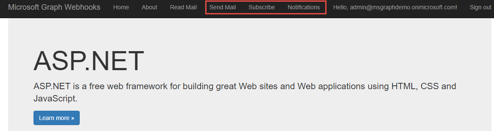

**Click** the **Subscribe** navigation menu item. This page will initiate a new subscription to your mailbox, and will show the subscription properties when complete.
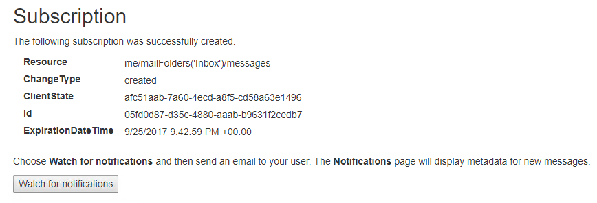

The subscription was created for mail messages, any time a new message is created in your inbox in the next 15 minutes (the lifetime of the subscription request) a notification is received. To see this, **click** the **Send mail** navigation menu item.  **Enter** your email address, a subject, and body, and click **Send**.

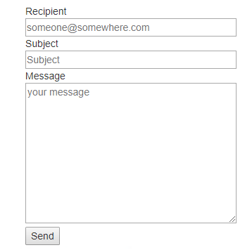

After a short time, your web application will receive a notification from Microsoft. To check for the notification, **click** the **Notifications** navigation menu item. Refresh the page until the new notification is shown.

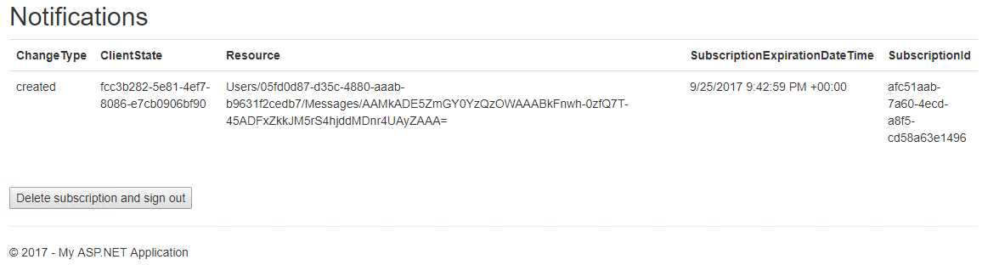

Your application could provide additional capabilities such as querying Microsoft Graph for additional data when a notification is received. This application allows multiple users to add subscriptions, but all users can see all notifications. Your application may require you to implement a per-user information store or filter data to only the notifications relevant to the current user.

## 3. Adding custom data to Microsoft Graph resources

This lab will walk you through working with custom data for resources using Microsoft Graph.

### Pre-requisites for Microsoft Graph resources application

This lab requires an Office 365 administrative user.

### Register the Graph Resources application

Visit the [Application Registration Portal](https://apps.dev.microsoft.com) and register a new application.  Make sure you are using a Office 365 Work and School account. Add a **Native** application platform. Add **delegated** permissions for **Directory.AccessAsUser.All** and **Group.ReadWrite.All**. Click **Save**.

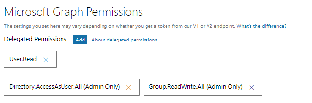

### Create the application

In Visual Studio 2017, **create** a new project using the **Console App (.NET Framework)** project template. **Right-click** the project node and choose **Manage NuGet packages**. **Click** the Browse tab, ensure the **Include pre-release** checkbox is checked, and search for **Microsoft.Identity.Client**. Click **Install**. **Click** the Browse tab and search for **Newtonsoft.Json**. Click **Install**.

**Right-click** the References node in the project and choose **Add Reference**. Add a reference for **System.Configuration**.

**Update** the `app.config` file and add an `appSettings` section as a child of the `configuration` element with the following structure:

````xml
  <appSettings>
    <add key="ida:clientId" value=""/>
  </appSettings>
````

**Update** the `ida:clientId` setting with the Application ID of the application you previously registered.

**Replace** the contents of `Program.cs` with the following:

````csharp
using System.Configuration;
using System.Threading.Tasks;

namespace CustomData
{
    class Program
    {
        static void Main(string[] args)
        {
            RunAsync(args).GetAwaiter().GetResult();
        }

        static async Task RunAsync(string[] args)
        {
            var clientId = ConfigurationManager.AppSettings["ida:clientId"];

            var openExtensionsDemo = new OpenExtensionsDemo();
            await openExtensionsDemo.RunAsync(clientId);

            var schemaExtensionDemo = new SchemaExtensionsDemo();
            await schemaExtensionDemo.RunAsync(clientId);
        }
    }
}
````

The first demonstration will use open extensions with Microsoft Graph.

**Add** a new class named `OpenExtensionsDemo.cs`.  **Replace** the contents with the following:

````csharp
using Microsoft.Identity.Client;
using Newtonsoft.Json.Linq;
using System;
using System.Collections.Generic;
using System.Linq;
using System.Net.Http;
using System.Net.Http.Headers;
using System.Text;
using System.Threading.Tasks;

namespace CustomData
{
    class OpenExtensionsDemo
    {

        public async Task RunAsync(string clientId)
        {
            PublicClientApplication pca = new PublicClientApplication(clientId);
            string[] scopes = { "User.ReadWrite" };
            var authResult = await pca.AcquireTokenAsync(scopes);
            var accessToken = authResult.AccessToken;

            using (var client = new HttpClient())
            {
                client.BaseAddress = new Uri("https://graph.microsoft.com/v1.0/");
                client.DefaultRequestHeaders.Authorization = new AuthenticationHeaderValue("Bearer", accessToken);

                //Use open extensions
                await AddRoamingProfileInformationAsync(client);
                await RetrieveRoamingProfileInformationAsync(client);
                await UpdateRoamingProfileInformationAsync(client);
                await DeleteRoamingProfileInformationAsync(client);
            }
        }
        async Task AddRoamingProfileInformationAsync(HttpClient client)
        {
            var request = new HttpRequestMessage(HttpMethod.Post, "me/extensions");
            request.Content = new StringContent("{'@odata.type':'microsoft.graph.openTypeExtension','extensionName':'com.contoso.roamingSettings','theme':'dark','color':'purple','lang':'Japanese'}", Encoding.UTF8, "application/json");
            var response = await client.SendAsync(request);
            response.WriteCodeAndReasonToConsole();
            Console.WriteLine(JValue.Parse(await response.Content.ReadAsStringAsync()).ToString(Newtonsoft.Json.Formatting.Indented));
            Console.WriteLine();
        }

        async Task RetrieveRoamingProfileInformationAsync(HttpClient client)
        {
            var request = new HttpRequestMessage(HttpMethod.Get, "me?$select=id,displayName,mail&$expand=extensions");
            var response = await client.SendAsync(request);
            response.WriteCodeAndReasonToConsole();
            Console.WriteLine(JValue.Parse(await response.Content.ReadAsStringAsync()).ToString(Newtonsoft.Json.Formatting.Indented));
            Console.WriteLine();
        }

        async Task UpdateRoamingProfileInformationAsync(HttpClient client)
        {
            var request = new HttpRequestMessage(new HttpMethod("PATCH"), "me/extensions/com.contoso.roamingSettings");
            request.Content = new StringContent("{'theme':'light','color':'blue','lang':'English'}", Encoding.UTF8, "application/json");
            var response = await client.SendAsync(request);
            response.WriteCodeAndReasonToConsole();

        }

         async Task DeleteRoamingProfileInformationAsync(HttpClient client)
        {
            var request = new HttpRequestMessage(HttpMethod.Delete, "me/extensions/com.contoso.roamingSettings");
            var response = await client.SendAsync(request);

            response.WriteCodeAndReasonToConsole();
        }


    }
}
````

The second demonstration will use schema extensions with Microsoft Graph.

**Add** a new class named `SchemaExtensionsDemo.cs`. **Replace** its contents with the following:

````csharp
using Microsoft.Identity.Client;
using Newtonsoft.Json.Linq;
using System;
using System.Net.Http;
using System.Net.Http.Headers;
using System.Text;
using System.Threading.Tasks;

namespace CustomData
{
    class SchemaExtensionsDemo
    {
        public async Task RunAsync(string clientId)
        {

            //The following method would only be needed to have an administrator
            //log in an grant administrative consent. For this lab, you will
            //already be logged in as an administrator, tenant-wide admin consent
            //is not needed.

            //LaunchBrowserWaitForAdminConsent(clientId, tenant, redirectUri);

            PublicClientApplication pca = new PublicClientApplication(clientId);
            string[] scopes = { "Group.ReadWrite.All", "Directory.AccessAsUser.All" };
            var authResult = await pca.AcquireTokenAsync(scopes);
            var accessToken = authResult.AccessToken;

            using (var client = new HttpClient())
            {
                client.BaseAddress = new Uri("https://graph.microsoft.com/v1.0/");
                client.DefaultRequestHeaders.Authorization = new AuthenticationHeaderValue("Bearer", accessToken);

                //Use schema extensions
                await ViewAvailableExtensionsAsync(client);

                var schemaId = await RegisterSchemaExtensionAsync(client);

                //Need to wait for schema to finish creating before creating group, otherwise get error
                System.Threading.Thread.Sleep(30000);

                var groupId = await CreateGroupWithExtendedDataAsync(client, schemaId);

                System.Threading.Thread.Sleep(30000);

                await UpdateCustomDataInGroupAsync(client, groupId, schemaId);

                System.Threading.Thread.Sleep(5000);

                await GetGroupAndExtensionDataAsync(client, schemaId);

                System.Threading.Thread.Sleep(30000);

                await DeleteGroupAndExtensionAsync(client, schemaId, groupId);
            }
        }

        //void LaunchBrowserWaitForAdminConsent(string clientId)
        //{
        //    string tenant = ConfigurationManager.AppSettings["ida:tenant"];
        //    string redirectUri = ConfigurationManager.AppSettings["ida:redirectUri"];
        //    Process p = new Process();
        //    ProcessStartInfo si = new ProcessStartInfo();
        //    p.StartInfo = si;
        //    si.UseShellExecute = true;
        //    si.FileName = @"C:\Program Files (x86)\Internet Explorer\iexplore.exe";
        //    si.Arguments = string.Format("https://login.microsoftonline.com/{0}/adminconsent?client_id={1}&state=12345&redirect_uri={2}", tenant, clientId, redirectUri);
        //    p.Start();
        //    p.WaitForExit();
        //}

        async Task ViewAvailableExtensionsAsync(HttpClient client)
        {
            var request = new HttpRequestMessage(HttpMethod.Get, "schemaextensions");

            var response = await client.SendAsync(request);
            response.WriteCodeAndReasonToConsole();
            Console.WriteLine(JValue.Parse(await response.Content.ReadAsStringAsync()).ToString(Newtonsoft.Json.Formatting.Indented));
            Console.WriteLine();
        }

        async Task<string> RegisterSchemaExtensionAsync(HttpClient client)
        {
            var request = new HttpRequestMessage(HttpMethod.Post, "schemaExtensions");
            request.Content = new StringContent("{'id':'courses','description':'Graph Learn training courses extensions','targetTypes':['Group'],'properties':[{'name':'courseId','type':'Integer'},{'name':'courseName','type':'String'},{'name':'courseType','type':'String'} ]}", Encoding.UTF8, "application/json");

            var response = await client.SendAsync(request);
            response.WriteCodeAndReasonToConsole();
            var responseBody = await response.Content.ReadAsStringAsync();

            JObject o = JObject.Parse(responseBody);
            Console.WriteLine(JValue.Parse(responseBody).ToString(Newtonsoft.Json.Formatting.Indented));
            Console.WriteLine();
            return (string)o["id"];
        }

        async Task<string> CreateGroupWithExtendedDataAsync(HttpClient client, string schemaId)
        {
            var request = new HttpRequestMessage(HttpMethod.Post, "groups");
            request.Content = new StringContent("{'displayName':'New Managers 2017','description':'New Managers training course 2017','groupTypes':['Unified'],'mailEnabled':true, 'mailNickName':'newManagers" + Guid.NewGuid().ToString().Substring(8) + "','securityEnabled':false,'" + schemaId + "':{'courseId':123,'courseName':'New Managers','courseType':'Online'}}", Encoding.UTF8, "application/json");

            var response = await client.SendAsync(request);
            response.WriteCodeAndReasonToConsole();
            var responseBody = await response.Content.ReadAsStringAsync();

            JObject o = JObject.Parse(responseBody);
            Console.WriteLine(JValue.Parse(responseBody).ToString(Newtonsoft.Json.Formatting.Indented));
            Console.WriteLine();
            return (string)o["id"];
        }

        async Task UpdateCustomDataInGroupAsync(HttpClient client, string groupId, string schemaId)
        {
            var request = new HttpRequestMessage(new HttpMethod("PATCH"), "groups/" + groupId);
            request.Content = new StringContent("{'" + schemaId + "':{'courseId':'123','courseName':'New Managers','courseType':'Online'}}", Encoding.UTF8, "application/json");

            var response = await client.SendAsync(request);
            response.WriteCodeAndReasonToConsole();
            Console.WriteLine();
        }

        async Task GetGroupAndExtensionDataAsync(HttpClient client, string schemaId)
        {
            var request = new HttpRequestMessage(HttpMethod.Get, "groups?$filter=" + schemaId + "/courseId eq '123'&$select=displayName,id,description," + schemaId);

            var response = await client.SendAsync(request);
            response.WriteCodeAndReasonToConsole();

            var responseBody = await response.Content.ReadAsStringAsync();

            JObject o = JObject.Parse(responseBody);

            Console.WriteLine(JValue.Parse(await response.Content.ReadAsStringAsync()).ToString(Newtonsoft.Json.Formatting.Indented));
            Console.WriteLine();
        }

        async Task DeleteGroupAndExtensionAsync(HttpClient client, string schemaId, string groupId)
        {
            var request = new HttpRequestMessage(HttpMethod.Delete, "schemaextensions/" + schemaId);

            var response = await client.SendAsync(request);
            response.WriteCodeAndReasonToConsole();

            Console.WriteLine();

            request = new HttpRequestMessage(HttpMethod.Delete, "groups/" + groupId);

            response = await client.SendAsync(request);
            response.WriteCodeAndReasonToConsole();

            Console.WriteLine();
        }
    }
}
````

Both classes use an extension method to write the HTTP status code and reason to console output.

**Add** a new class named `HttpResponseMessageExtension.cs`.  **Replace** its contents with the following:

````csharp
using System;
using System.Net.Http;

namespace CustomData
{
    public static class HttpResponseMessageExtension
    {
        public static void WriteCodeAndReasonToConsole(this HttpResponseMessage response)
        {


            var defaultBGColor = Console.BackgroundColor;
            var defaultFGColor = Console.ForegroundColor;

            if (response.IsSuccessStatusCode)
            {
                Console.ForegroundColor = ConsoleColor.Black;
                Console.BackgroundColor = ConsoleColor.Green;
                Console.Write(response.StatusCode);
            }

            if (!response.IsSuccessStatusCode)
            {
                Console.ForegroundColor = ConsoleColor.White;
                Console.BackgroundColor = ConsoleColor.Red;
                Console.Write(response.StatusCode);
                Console.WriteLine(" - " + response.ReasonPhrase);
            }
            Console.BackgroundColor = defaultBGColor;
            Console.ForegroundColor = defaultFGColor;
            Console.WriteLine();
        }
    }
}
````

### Run the Microsoft Graph resources application

Run the application.

You are prompted to log in and grant consent to read and write the current user's profile. After granting consent, the application will continue.

The application is making REST calls to the Microsoft Graph to demonstrate the capabilities of using open extensions. The console output will show green highlighted text for successful calls, and red highlighted text if calls do not succeed.

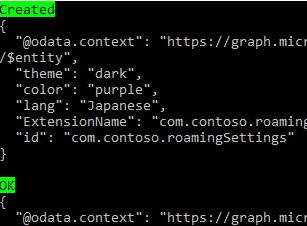

You are prompted to log in a second time. This is on purpose, to demonstrate the difference in permissions that these two approaches require. Notice that you are again prompted for consent, this time to read and write groups and to access the directory as the user.  Grant permissions, and the application will continue.

The application is now making REST calls to the Microsoft Graph to demonstrate the capabilities of using schema extensions. Just as before, the console output will show green highlighted text for successful calls, and red highlighted text if calls do not succeed.

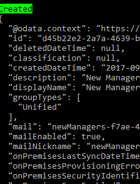

> Note that there is a `Thread.Sleep` call between each operation. This is required to avoid a race condition with resources as they are being created.

## 4. Developing insights with Microsoft Graph

This lab will show how to use the Insights resource with Microsoft Graph.

### Register the insights application

Visit the [Application Registration Portal](https://apps.dev.microsoft.com). **Register** a new Converged application, and copy the generated application ID for later use as the Client ID.  **Configure** the application:

- Add a new secret by clicking the **Generate new password** button and copy the secret to use later as the Client Secret.
- Click the **Add Platform** button. A popup is presented, choose **Web**.
- Add a Redirect URL to use while debugging locally (the default setting for the Visual Studio project is `https://localhost:44326/`, if you use something else you need to change this value for your app registration).
- Click **Save** to save all changes.

### Clone the insights starting application

The application will use OpenId Connect with the v2.0 endpoint as a starting point. To start, you will clone the project from GitHub. From your shell or command line:

````shell
git clone https://github.com/Azure-Samples/active-directory-dotnet-webapp-openidconnect-v2.git
````

**Open** the project with Visual Studio 2017.

**Edit** the `web.config` file with your app's coordinates.

- Find the appSettings key `ida:ClientId` and provide the Application ID from your app registration.
- Find the appSettings key `ida:ClientSecret` and provide the value from the secret generated in the previous step.

The Insights resource requires the Sites.Read.All delegated permission. **Edit** the `App_Start/Startup.Auth.cs` file and edit the scope parameter to include the `Sites.Read.All` permission scope in the space-delimited list.

```csharp
Scope = "openid email profile offline_access Mail.Read Sites.Read.All",
```

The application will de-serialize JSON data returned from Microsoft Graph into strongly-typed classes.  **Right-click** the `Models` folder and add a new class `Insights.cs`. **Replace** the contents of `Insights.cs` with the following:

```csharp
using Newtonsoft.Json;
using System;
using System.Collections.Generic;

public class ResourceVisualization
{

    [JsonProperty("title")]
    public string title { get; set; }

    [JsonProperty("type")]
    public string type { get; set; }

    [JsonProperty("mediaType")]
    public string mediaType { get; set; }

    [JsonProperty("previewImageUrl")]
    public string previewImageUrl { get; set; }

    [JsonProperty("previewText")]
    public string previewText { get; set; }

    [JsonProperty("containerWebUrl")]
    public string containerWebUrl { get; set; }

    [JsonProperty("containerDisplayName")]
    public string containerDisplayName { get; set; }

    [JsonProperty("containerType")]
    public string containerType { get; set; }
}

public class ResourceReference
{

    [JsonProperty("webUrl")]
    public string webUrl { get; set; }

    [JsonProperty("id")]
    public string id { get; set; }

    [JsonProperty("type")]
    public string type { get; set; }
}

public class TrendingInsights
{

    [JsonProperty("@odata.context")]
    public string context { get; set; }

    [JsonProperty("value")]
    public IList<TrendingValue> value { get; set; }
}

public class TrendingValue
{

    [JsonProperty("id")]
    public string id { get; set; }

    [JsonProperty("weight")]
    public double weight { get; set; }

    [JsonProperty("resourceVisualization")]
    public ResourceVisualization resourceVisualization { get; set; }

    [JsonProperty("resourceReference")]
    public ResourceReference resourceReference { get; set; }
}

public class SharedInsights
{

    [JsonProperty("@odata.context")]
    public string context { get; set; }

    [JsonProperty("value")]
    public IList<SharedValue> value { get; set; }
}

public class SharedValue
{

    [JsonProperty("id")]
    public string id { get; set; }

    [JsonProperty("lastShared")]
    public LastShared lastShared { get; set; }

    [JsonProperty("resourceVisualization")]
    public ResourceVisualization resourceVisualization { get; set; }

    [JsonProperty("resourceReference")]
    public ResourceReference resourceReference { get; set; }
}

public class SharedBy
{

    [JsonProperty("displayName")]
    public string displayName { get; set; }

    [JsonProperty("address")]
    public string address { get; set; }

    [JsonProperty("id")]
    public string id { get; set; }
}

public class SharingReference
{

    [JsonProperty("webUrl")]
    public string webUrl { get; set; }

    [JsonProperty("id")]
    public string id { get; set; }

    [JsonProperty("type")]
    public string type { get; set; }
}

public class LastShared
{

    [JsonProperty("sharedDateTime")]
    public DateTime sharedDateTime { get; set; }

    [JsonProperty("sharingSubject")]
    public string sharingSubject { get; set; }

    [JsonProperty("sharingType")]
    public string sharingType { get; set; }

    [JsonProperty("sharedBy")]
    public SharedBy sharedBy { get; set; }

    [JsonProperty("sharingReference")]
    public SharingReference sharingReference { get; set; }
}

public class UsedInsights
{

    [JsonProperty("@odata.context")]
    public string context { get; set; }

    [JsonProperty("value")]
    public IList<LastUsedValue> value { get; set; }
}

public class LastUsedValue
{

    [JsonProperty("id")]
    public string id { get; set; }

    [JsonProperty("lastUsed")]
    public LastUsed lastUsed { get; set; }

    [JsonProperty("resourceVisualization")]
    public ResourceVisualization resourceVisualization { get; set; }

    [JsonProperty("resourceReference")]
    public ResourceReference resourceReference { get; set; }
}

public class LastUsed
{

    [JsonProperty("lastAccessedDateTime")]
    public DateTime lastAccessedDateTime { get; set; }

    [JsonProperty("lastModifiedDateTime")]
    public DateTime lastModifiedDateTime { get; set; }
}
```

**Right-click** the `Controllers` folder, choose **Add / Controller**, choose the **MVC 5 Controller - Empty** project item template, and name the new controller `InsightsController`. **Replace** the contents of `InsightsController.cs` with the following:

```csharp
using Microsoft.Identity.Client;
using Newtonsoft.Json;
using System;
using System.Collections.Generic;
using System.Configuration;
using System.Linq;
using System.Net.Http;
using System.Net.Http.Headers;
using System.Security.Claims;
using System.Threading.Tasks;
using System.Web;
using System.Web.Mvc;
using WebApp_OpenIDConnect_DotNet.Models;

namespace WebApp.Controllers
{
    public class InsightsController : Controller
    {
        public static string clientId = ConfigurationManager.AppSettings["ida:ClientId"];
        private static string appKey = ConfigurationManager.AppSettings["ida:ClientSecret"];
        private static string redirectUri = ConfigurationManager.AppSettings["ida:RedirectUri"];

        // GET: Insights
        public async Task<ActionResult> Index()
        {
            return View();
        }

        [Authorize]
        public async Task<ActionResult> Shared()
        {
            var ret = new SharedInsights();

            HttpClient client = new HttpClient();
            HttpRequestMessage request = new HttpRequestMessage(HttpMethod.Get, "https://graph.microsoft.com/beta/me/insights/shared");

            // try to get token silently
            string signedInUserID = ClaimsPrincipal.Current.FindFirst(ClaimTypes.NameIdentifier).Value;
            TokenCache userTokenCache = new MSALSessionCache(signedInUserID, this.HttpContext).GetMsalCacheInstance();
            ConfidentialClientApplication cca = new ConfidentialClientApplication(clientId, redirectUri,new ClientCredential(appKey), userTokenCache, null);
            var accounts = await cca.GetAccountsAsync();
            if (accounts.Any())
            {
                string[] scopes = { "Sites.Read.All" };
                try
                {
                    AuthenticationResult result = await cca.AcquireTokenSilentAsync(scopes, accounts.First());

                    request.Headers.Authorization = new AuthenticationHeaderValue("Bearer", result.AccessToken);
                    HttpResponseMessage response = await client.SendAsync(request);

                    if (response.IsSuccessStatusCode)
                    {
                        ViewBag.AuthorizationRequest = null;
                        var responseBody = await response.Content.ReadAsStringAsync();
                        ret = JsonConvert.DeserializeObject<SharedInsights>(responseBody);
                    }
                }
                catch (MsalUiRequiredException)
                {
                    try
                    {// when failing, manufacture the URL and assign it
                        string authReqUrl = await WebApp.Utils.OAuth2RequestManager.GenerateAuthorizationRequestUrl(scopes, cca, this.HttpContext, Url);
                        ViewBag.AuthorizationRequest = authReqUrl;
                    }
                    catch (Exception ee)
                    {
                        Response.Write(ee.Message);
                    }
                }
            }
            else { }
            return View(ret);
        }

        [Authorize]
        public async Task<ActionResult> Trending()
        {
            var ret = new TrendingInsights();
            HttpClient client = new HttpClient();
            HttpRequestMessage request = new HttpRequestMessage(HttpMethod.Get, "https://graph.microsoft.com/beta/me/insights/trending");

            // try to get token silently
            string signedInUserID = ClaimsPrincipal.Current.FindFirst(ClaimTypes.NameIdentifier).Value;
            TokenCache userTokenCache = new MSALSessionCache(signedInUserID, this.HttpContext).GetMsalCacheInstance();
            ConfidentialClientApplication cca = new ConfidentialClientApplication(clientId, redirectUri,new ClientCredential(appKey), userTokenCache, null);
            var accounts = await cca.GetAccountsAsync();
            if (accounts.Any())
            {
                string[] scopes = { "Sites.Read.All" };
                try
                {
                    AuthenticationResult result = await cca.AcquireTokenSilentAsync(scopes, accounts.First());

                    request.Headers.Authorization = new AuthenticationHeaderValue("Bearer", result.AccessToken);
                    HttpResponseMessage response = await client.SendAsync(request);

                    if (response.IsSuccessStatusCode)
                    {
                        var responseBody = await response.Content.ReadAsStringAsync();
                        ret = JsonConvert.DeserializeObject<TrendingInsights>(responseBody);
                        ViewBag.AuthorizationRequest = null;
                    }
                }
                catch (MsalUiRequiredException)
                {
                    try
                    {// when failing, manufacture the URL and assign it
                        string authReqUrl = await WebApp.Utils.OAuth2RequestManager.GenerateAuthorizationRequestUrl(scopes, cca, this.HttpContext, Url);
                        ViewBag.AuthorizationRequest = authReqUrl;
                    }
                    catch (Exception ee)
                    {
                        Response.Write(ee.Message);
                    }
                }
            }
            else { }
            return View(ret);
        }

        [Authorize]
        public async Task<ActionResult> Used()
        {
            var ret = new UsedInsights();

            HttpClient client = new HttpClient();
            HttpRequestMessage request = new HttpRequestMessage(HttpMethod.Get, "https://graph.microsoft.com/beta/me/insights/used");

            // try to get token silently
            string signedInUserID = ClaimsPrincipal.Current.FindFirst(ClaimTypes.NameIdentifier).Value;
            TokenCache userTokenCache = new MSALSessionCache(signedInUserID, this.HttpContext).GetMsalCacheInstance();
            ConfidentialClientApplication cca = new ConfidentialClientApplication(clientId, redirectUri,new ClientCredential(appKey), userTokenCache, null);
            var accounts = await cca.GetAccountsAsync();
            if (accounts.Any())
            {
                string[] scopes = { "Sites.Read.All" };
                try
                {
                    AuthenticationResult result = await cca.AcquireTokenSilentAsync(scopes, accounts.First());

                    request.Headers.Authorization = new AuthenticationHeaderValue("Bearer", result.AccessToken);
                    HttpResponseMessage response = await client.SendAsync(request);

                    if (response.IsSuccessStatusCode)
                    {
                        var responseBody = await response.Content.ReadAsStringAsync();
                        ret = JsonConvert.DeserializeObject<UsedInsights>(responseBody);

                        ViewBag.AuthorizationRequest = null;
                    }
                }
                catch (MsalUiRequiredException)
                {
                    try
                    {// when failing, manufacture the URL and assign it
                        string authReqUrl = await WebApp.Utils.OAuth2RequestManager.GenerateAuthorizationRequestUrl(scopes, cca, this.HttpContext, Url);
                        ViewBag.AuthorizationRequest = authReqUrl;
                    }
                    catch (Exception ee)
                    {
                        Response.Write(ee.Message);
                    }
                }
            }
            else { }
            return View(ret);
        }
    }
}
```

Each controller method returns a different model to use with its view. **Right-click** the `Views / Insights` folder and choose **Add / View**. Add four empty views:

- `Index.cshtml`
- `Shared.cshtml`
- `Trending.cshtml`
- `Used.cshtml`

**Replace** the contents of `Index.cshtml` with the following:

```html
@{
    ViewBag.Title = "Index";
}

<h2>Index</h2>

@Html.ActionLink("View trending", "Trending")

@Html.ActionLink("View shared", "Shared")

@Html.ActionLink("View used", "Used")
```

**Replace** the contents of `Shared.cshtml` with the following:

```html
@model SharedInsights

@{
    ViewBag.Title = "Shared";
}

<h2>Shared</h2>

<div>
    <h4>SharedInsights</h4>
    <hr />
    <dl class="dl-horizontal">
        <dt>
            @Html.DisplayNameFor(model => model.context)
        </dt>

        <dd>
            @Html.DisplayFor(model => model.context)
        </dd>

        @foreach (var item in Model.value)
        {

            <dt>
                @Html.DisplayNameFor(modelItem => item.id)
            </dt>
            <dd>
                @Html.DisplayFor(modelItem => item.id)
            </dd>
            <dt>
                @Html.DisplayNameFor(modelItem => item.lastShared.sharedBy)
            </dt>
            <dd>
                @Html.DisplayFor(modelItem => item.lastShared.sharedBy)
            </dd>
            <dt>
                @Html.DisplayNameFor(modelItem => item.lastShared.sharedDateTime)
            </dt>
            <dd>
                @Html.DisplayFor(modelItem => item.lastShared.sharedDateTime)
            </dd>
            <dt>
                @Html.DisplayNameFor(modelItem => item.lastShared.sharingSubject)
            </dt>
            <dd>
                @Html.DisplayFor(modelItem => item.lastShared.sharingSubject)
            </dd>
            <dt>
                @Html.DisplayNameFor(modelItem => item.lastShared.sharingType)
            </dt>
            <dd>
                @Html.DisplayFor(modelItem => item.lastShared.sharingType)
            </dd>
            <dt>
                @Html.DisplayNameFor(modelItem => item.lastShared.sharingReference.id)
            </dt>
            <dd>
                @Html.DisplayFor(modelItem => item.lastShared.sharingReference.id)
            </dd>
            <dt>
                @Html.DisplayNameFor(modelItem => item.lastShared.sharingReference.type)
            </dt>
            <dd>
                @Html.DisplayFor(modelItem => item.lastShared.sharingReference.type)
            </dd>
            <dt>
                @Html.DisplayNameFor(modelItem => item.lastShared.sharingReference.webUrl)
            </dt>
            <dd>
                @Html.DisplayFor(modelItem => item.lastShared.sharingReference.webUrl)
            </dd>

            <dt>
                @Html.DisplayNameFor(modelItem => item.lastShared.sharedBy)
            </dt>
            <dd>
                @Html.DisplayFor(modelItem => item.lastShared.sharedBy)
            </dd>
            @Html.Partial("_ResourceReference", item.resourceReference)
            @Html.Partial("_ResourceVisualization", item.resourceVisualization)
        }
    </dl>
</div>
<p>
    @Html.ActionLink("Back to List", "Index")
</p>
```

**Replace** the contents of `Trending.cshtml` with the following:

```html
@model TrendingInsights

@{
    ViewBag.Title = "Trending";
}

<h2>Trending</h2>

<div>
    <h4>TrendingInsights</h4>
    <hr />
    <dl class="dl-horizontal">
        <dt>
            @Html.DisplayNameFor(model => model.context)
        </dt>

        <dd>
            @Html.DisplayFor(model => model.context)
        </dd>

        @foreach (var item in Model.value)
        {

            <dt>
                @Html.DisplayNameFor(modelItem => item.id)
            </dt>
            <dd>
                @Html.DisplayFor(modelItem => item.id)
            </dd>
            <dt>
                @Html.DisplayNameFor(modelItem => item.weight)
            </dt>
            <dd>
                @Html.DisplayFor(modelItem => item.weight)
            </dd>
            @Html.Partial("_ResourceReference", item.resourceReference)
            @Html.Partial("_ResourceVisualization", item.resourceVisualization)
        }

    </dl>
</div>
<p>
    @Html.ActionLink("Back to List", "Index")
</p>
```

**Replace** the contents of `Used.cshtml` with the following:

```html
@model UsedInsights

@{
    ViewBag.Title = "Used";
}

<h2>Used</h2>

<div>
    <h4>UsedInsights</h4>
    <hr />
    <dl class="dl-horizontal">
        <dt>
            @Html.DisplayNameFor(model => model.context)
        </dt>

        <dd>
            @Html.DisplayFor(model => model.context)
        </dd>
@foreach (var item in Model.value)
{

    <dt>
        @Html.DisplayNameFor(modelItem => item.id)
    </dt>
            <dd>
                @Html.DisplayFor(modelItem => item.id)
            </dd>
            <dt>
                @Html.DisplayNameFor(modelItem => item.lastUsed)
            </dt>
            <dd>
                @Html.DisplayFor(modelItem => item.lastUsed)
            </dd>

            @Html.Partial("_ResourceReference", item.resourceReference)
            @Html.Partial("_ResourceVisualization", item.resourceVisualization)
}
    </dl>
</div>
<p>
    @Html.ActionLink("Back to List", "Index")
</p>
```

Each of these views uses two partial views, `_ResourceReference` and `_ResourceVisualization`. Partial views make it easy to encapsulate code that is common across multiple views.

**Right-click** the `Views / Shared` folder and choose **Add / View**. Name the new view `_ResourceReference`, change the template to **Details**, and change the model class to **ResourceReference**. Check the **Create as partial view** checkbox and click **Add**.


**Repeat** these steps to add a partial view for `_ResourceVisualization`. Name the new view `_ResourceVisualization`, change the template to **Details**, and change the model class to **ResourceVisualization**. Check the **Create as partial view** checkbox and click **Add**.

Finally, update the top-level navigation for the web site. **Edit** the `Views / Shared / _Layout.cshtml` file and **add** a link to the new controller.

```html
<li>@Html.ActionLink("Read Mail", "ReadMail", "Home")</li>
<li>@Html.ActionLink("Send Mail", "SendMail", "Home")</li>
<li>@Html.ActionLink("Insights", "Index", "Insights")</li>
```

### Run the insights application

Run the application, then click on the **Sign in with Microsoft** link. You are prompted to sign in and to grant the application the requested permissions. After consenting, the page is displayed. Click the **Insights** link at the top of the page, then choose the **View Trending** link. The information is displayed.


## 5. Creating batch requests with Microsoft Graph

This lab will show how to use the batch resource with Microsoft Graph.

### Pre-requisites for insights application

This lab requires an Office 365 user.

### Register the batch requests application

Visit the [Application Registration Portal](https://apps.dev.microsoft.com) and register a new application. Add a **Native** application platform. Add **delegated** permissions for **Mail.Read**, **Calendars.Read**, **Contacts.Read**. Click **Save**.


### Create the insights application

In Visual Studio 2017, **create** a new project using the **Console App (.NET Framework)** project template. **Right-click** the project node and choose **Manage NuGet packages**. **Click** the Browse tab, ensure the **Include pre-release** checkbox is checked, and search for **Microsoft.Identity.Client**. Click **Install**. **Click** the Browse tab and search for **Newtonsoft.Json**. Click **Install**.

**Right-click** the References node in the project and choose **Add Reference**. Add a reference for **System.Configuration**.

**Update** the `app.config` file and add an `appSettings` section as a child of the `configuration` element with the following structure:

```xml
  <appSettings>
    <add key="ida:clientId" value=""/>
  </appSettings>
```

**Update** the `ida:clientId` setting with the Application ID of the application you previously registered.

**Replace** the contents of `Program.cs` with the following:

```csharp
using System.Configuration;
using System.Threading.Tasks;

namespace Batch
{
    class Program
    {
        static void Main(string[] args)
        {
            RunAsync(args).GetAwaiter().GetResult();
        }

        static async Task RunAsync(string[] args)
        {

            var clientId = ConfigurationManager.AppSettings["ida:clientId"];

            var batchDemo = new BatchDemo();
            await batchDemo.RunAsync(clientId);

            System.Console.WriteLine("Press ENTER to continue.");
            System.Console.ReadLine();
        }
    }
}
```

**Add** a new class named `BatchDemo.cs`.  **Replace** the contents with the following:

```csharp
using Microsoft.Identity.Client;
using Newtonsoft.Json.Linq;
using System;
using System.Net.Http;
using System.Net.Http.Headers;
using System.Text;
using System.Threading.Tasks;

namespace Batch
{
    class BatchDemo
    {
        public async Task RunAsync(string clientId)
        {
            PublicClientApplication pca = new PublicClientApplication(clientId);
            string[] scopes = { "User.ReadWrite Calendars.Read Mail.Read Contacts.Read" };
            var authResult = await pca.AcquireTokenAsync(scopes);
            var accessToken = authResult.AccessToken;

            using (var client = new HttpClient())
            {
                client.BaseAddress = new Uri("https://graph.microsoft.com/v1.0/");
                client.DefaultRequestHeaders.Authorization = new AuthenticationHeaderValue("Bearer", accessToken);

                await RetrieveUserOutlookData(client);
            }
        }

        async Task RetrieveUserOutlookData(HttpClient client)
        {
            var request = new HttpRequestMessage(HttpMethod.Post, "$batch");
            request.Content = new StringContent(@"{
                  'requests': [
                    {
                      'id': '1',
                      'method': 'GET',
                      'url': '/me/messages?$top=1'
                    },
                    {
                      'id': '2',
                      'dependsOn': [ '1' ],
                      'method': 'GET',
                      'url': '/me/calendar/events?$top=1'
                    },
                    {
                      'id': '3',
                      'dependsOn': [ '2' ],
                      'method': 'GET',
                      'url': 'me/contacts?$top=1'
                    }
                  ]
                }", Encoding.UTF8, "application/json");
            var response = await client.SendAsync(request);
            response.WriteCodeAndReasonToConsole();
            Console.WriteLine(JValue.Parse(await response.Content.ReadAsStringAsync()).ToString(Newtonsoft.Json.Formatting.Indented));
            Console.WriteLine();
        }
    }
}
```

The `BatchDemo` class uses an extension method to write the HTTP status code and reason to console output.

**Add** a new class named `HttpResponseMessageExtension.cs`.  **Replace** its contents with the following:

```csharp
using System;
using System.Net.Http;

namespace CustomData
{
    public static class HttpResponseMessageExtension
    {
        public static void WriteCodeAndReasonToConsole(this HttpResponseMessage response)
        {


            var defaultBGColor = Console.BackgroundColor;
            var defaultFGColor = Console.ForegroundColor;

            if (response.IsSuccessStatusCode)
            {
                Console.ForegroundColor = ConsoleColor.Black;
                Console.BackgroundColor = ConsoleColor.Green;
                Console.Write(response.StatusCode);
            }

            if (!response.IsSuccessStatusCode)
            {
                Console.ForegroundColor = ConsoleColor.White;
                Console.BackgroundColor = ConsoleColor.Red;
                Console.Write(response.StatusCode);
                Console.WriteLine(" - " + response.ReasonPhrase);
            }
            Console.BackgroundColor = defaultBGColor;
            Console.ForegroundColor = defaultFGColor;
            Console.WriteLine();
        }
    }
}
```

### Run the batch requests application

Run the application.

You are prompted to log in and grant consent to read and write the current user's profile. After granting consent, the application will continue.

The application is making a REST calls to the Microsoft Graph that submits 3 requests in one call to retrieve the top Mail item, Calendar item, and Contact item from your account.

The code adds the additional `dependsOn` property which causes the batch to execute those items in order, so the request with `id` '1' will go first because request '2' depends on it, etc. If the `dependsOn` property is removed all the requests will execute in parallel. There is no guarantee that the responses will return in order, but each response will include the `id` you specified. For more information see [Combine multiple requests in one HTTP call using JSON batching](https://developer.microsoft.com/en-us/graph/docs/concepts/json_batching).


